## 1. Создать новый проект в Google Cloud Platform, Яндекс облако или на любых ВМ, докере. Далее создать инстанс виртуальной машины с дефолтными параметрами. Добавить свой ssh ключ в metadata ВМ
ВМ развернул локально у себя на ноутбуке в **VMware Workstation**. Использовал ОС **Ubuntu 22.04.4 LTS**.

## 2. Зайти удаленным ssh (первая сессия), не забывайте про ssh-add. Поставить PostgreSQL.
Установил **PostgreSQL 14** следующими командами:
```
sudo install -d /usr/share/postgresql-common/pgdg

sudo curl -o /usr/share/postgresql-common/pgdg/apt.postgresql.org.asc --fail https://www.postgresql.org/media/keys/ACCC4CF8.asc

sudo sh -c 'echo "deb [signed-by=/usr/share/postgresql-common/pgdg/apt.postgresql.org.asc] https://apt.postgresql.org/pub/repos/apt $(lsb_release -cs)-pgdg main" > /etc/apt/sources.list.d/pgdg.list'

sudo apt update

sudo apt -y install postgresql-14
```
**PostgreSQL 14** установлен успешно:  

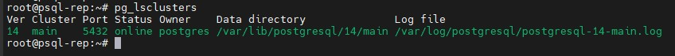

## 3. Зайти вторым ssh (вторая сессия). Запустить везде psql из под пользователя postgres
Создал вторую **SSH** сессия и зарустил везде **psql** под пользователем **postgres**:  

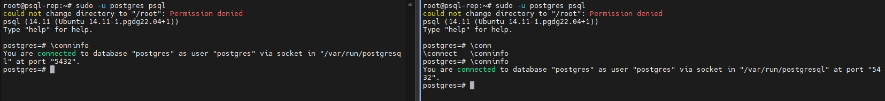

## 4. Выключить auto commit
Выключил auto commit в первой и второй сессии командой:  
```
\set AUTOCOMMIT OFF
```
**Auto commit** успешно отключен:  

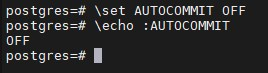

## 5. В первой сессии новую таблицу и наполнить ее данными
Создал таблицу и наполнил ее данными следующими запросами:  
```
create table persons(id serial, first_name text, second_name text);
insert into persons(first_name, second_name) values('ivan', 'ivanov');
insert into persons(first_name, second_name) values('petr', 'petrov');
commit;
```
Все операции выполнены успешно:  

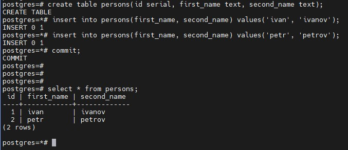

## 5. Посмотреть текущий уровень изоляции
Посмотрел текущий уровень изоляции командой:  
```
show transaction isolation level;
```
Текущий уровень изоляции **read committed**:

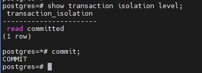

## 6. Начать новую транзакцию в обоих сессиях с дефолтным (не меняя) уровнем изоляции
Начал транзакции в обоих сессиях следующей командой:  
```
begin;
```
Тразакция началась в обоих сессиях:  

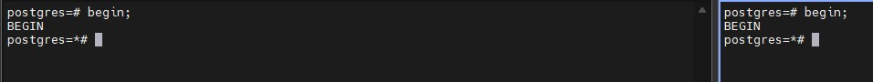

## 7. В первой сессии добавить новую запись в таблицу
В первой сессии добавил новую запись в таблицу запросом:  
```
insert into persons(first_name, second_name) values('sergey', 'sergeev');
```
Выполнено:  

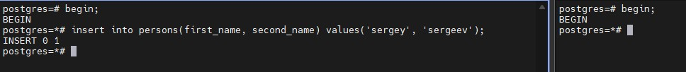

## 8. Сделать select from persons во второй сессии
Выполнил **SELECT** во второй сессии командой:  
```
select * from persons;
```
Вывод:  

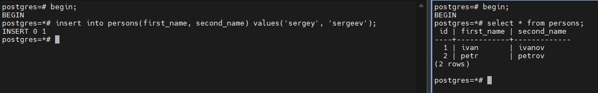

## 9. Видите ли вы новую запись и если да то почему?

Новую запись не вижу. Если все правильно понял, то по умолчанию в **PostgreSQL** используется уровень изоляции **read committed**. Вот выдержка из документации по принципу работы:
 > В транзакции, работающей на этом уровне, запрос SELECT (без предложения FOR UPDATE/SHARE) видит только те данные, которые были зафиксированы до начала запроса; он никогда не увидит незафиксированных данных или изменений, внесённых в процессе выполнения запроса параллельными транзакциями. По сути запрос SELECT видит снимок базы данных в момент начала выполнения запроса. 

 Так как транзакция в первой сессии не зафискирована, то при выполнении **SELECT** во второй сессиии изменения мы не увидим.

## 10. Завершить первую транзакцию. Сделать select from persons во второй сессии
В первой сессии выполнил команду:  
```
commit;
```
Во второй сессии выполнил команду:  
```
select * from persons;
```
Результаты:  

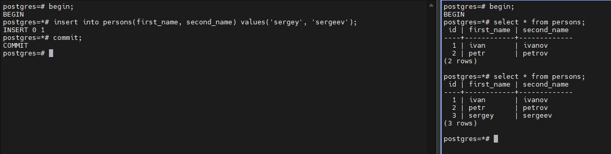

## 11. Видите ли вы новую запись и если да то почему?
Запись вижу, так как в первой сессии изменения были зафиксированы командой **commit**.

## 12. Завершите транзакцию во второй сессии
Завершил транзакцию во второй сессии командой:  
```
commit;
```
Результаты:  

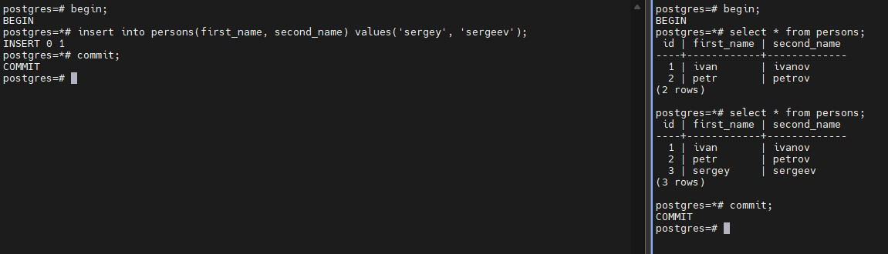

## 13. Начать новые но уже repeatable read транзации
В первой и второй сессии выполнил следующие запросы:  
```
begin;
set transaction isolation level repeatable read;
``` 
Результаты:  

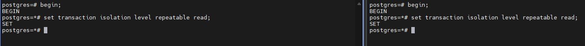

## 14. В первой сессии добавить новую запись в таблицу. Сделать select from persons во второй сессии
В первой сессии добавил новую запись в таблицу запросом:  
```
insert into persons(first_name, second_name) values('sveta', 'svetova');
```
Во второй сессии выполнил запрос:  
```
select * from persons;
```
Результаты:  

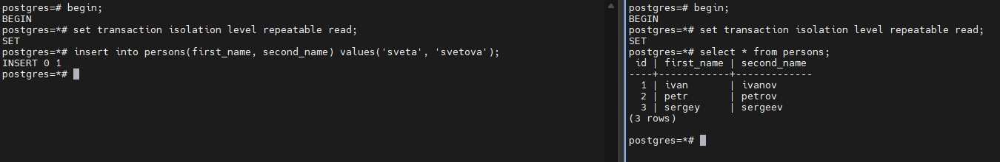

## 15. Видите ли вы новую запись и если да то почему?
Новую запись не вижу, так как в режиме **Repeatable Read** не видны незафиксированные данные из других транзакций. Если обратиться к документации:  
> Этот уровень отличается от Read Committed тем, что запрос в транзакции данного уровня видит снимок данных на момент начала первого оператора в транзакции (не считая команд управления транзакциями), а не начала текущего оператора. Таким образом, последовательные команды SELECT в одной транзакции видят одни и те же данные; они не видят изменений, внесённых и зафиксированных другими транзакциями после начала их текущей транзакции.

То есть, если не считать команды управления транзакциями (BEGIN, SET TRANSACTION), то в данной транзакции должны быть видны данные зафиксированные до первого выполнения оператора **SELECT**. В первой сессии изменения НЕ зафиксированы, соответсвенно, во второй сессии мы их не видим.

## 16. Завершить первую транзакцию - commit. Сделать select from persons во второй сессии
В первой сессии зафиксировал изменения:  
```
commit;
```
Во второй сессии выполнил запрос:  
```
select * from persons;
```
Результат:  

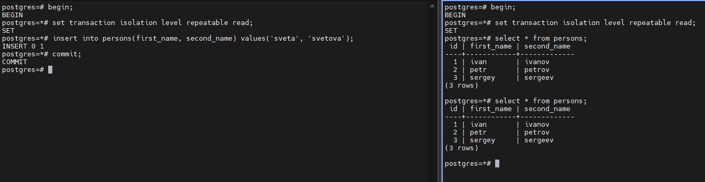

## 17. Видите ли вы новую запись и если да то почему?
Новую запись не вижу, так как во второй транзакции видны только те данные, которые были зафиксированы ДО выполнения первого оператора **SELECT**, а не текущего оператора **SELECT** как это работает в режиме **Read Committed**. Соответсвенно, до выполнения ПЕРВОГО оператора **SELECT** во второй транзакции изменения в первой транзакции зафиксированы еще не были, именно поэтому мы их и не видим.

## 18. Завершить вторую транзакцию. Сделать select * from persons во второй сессии
Завершил вторую транзакцию командой: 
```
commit;
```
Выполнил запрос во второй сессии:  
```
select * from persons;
```
Результаты:  

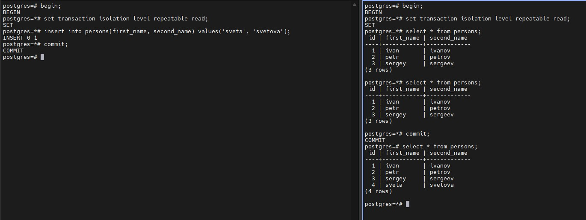

## 19. Видите ли вы новую запись и если да то почему?
Новую запись вижу, так как по сути во второй сессии была начата новая транзакция и в рамках новой транзакции был использован "снимок" данных ДО первого оператора транзакции, а именно последнего **SELECT'а**. Все изменения в первой сессии были зафиксированы, поэтому мы видим новую строку в таблице.