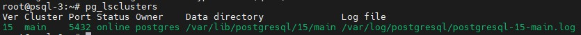
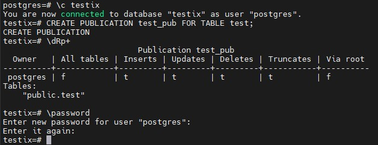
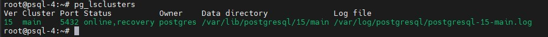

## 1. Подготовка ВМ и установка PostgreSQL
Развернул 4 ВМ локально у себя на ноутбуке в **VMware Workstation**. Использовал ОС **Ubuntu Server 22.04.4 LTS**.  
Использовалась следующая конфигурация ВМ:  
**ОЗУ**: 4Гб  
**ЦП**: 2  
**SSD**: 30Гб  

Установил **PostgreSQL 15** на всех ВМ следующими командами:
```
sudo install -d /usr/share/postgresql-common/pgdg

sudo curl -o /usr/share/postgresql-common/pgdg/apt.postgresql.org.asc --fail https://www.postgresql.org/media/keys/ACCC4CF8.asc

sudo sh -c 'echo "deb [signed-by=/usr/share/postgresql-common/pgdg/apt.postgresql.org.asc] https://apt.postgresql.org/pub/repos/apt $(lsb_release -cs)-pgdg main" > /etc/apt/sources.list.d/pgdg.list'

sudo apt update

sudo apt -y install postgresql-15
```
**PostgreSQL 15** на всех 4 ВМ установлен успешно:  





## 2. На 1 ВМ создаем таблицы test для записи, test2 для запросов на чтение.
Создал БД, и соответсвующие таблицы следующими командами:  
```
ALTER SYSTEM SET wal_level = logical;
CREATE DATABASE testix;
\c testix
CREATE TABLE test AS SELECT generate_series(1, 100) AS id, md5(random()::text)::char(10) AS fio;
CREATE TABLE test2 (id int, fio char(10));
```
Также после установки значения параметра **wal_level** перезапустим кластер:  
```
pg_ctlcluster 15 main stop
pg_ctlcluster 15 main start
```
Все операции выполнены успешно. Результаты:  


## 3. На 2 ВМ создаем таблицы test2 для записи, test для запросов на чтение.
На 2 ВМ далаем то же самое, только наоборот следующими командами:
```
ALTER SYSTEM SET wal_level = logical;
CREATE DATABASE testix;
\c testix
CREATE TABLE test2 AS SELECT generate_series(1, 100) AS id, md5(random()::text)::char(10) AS fio;
CREATE TABLE test (id int, fio char(10));
```
Также после установки значения параметра **wal_level** перезапустим кластер:  
```
pg_ctlcluster 15 main stop
pg_ctlcluster 15 main start
```
Все операции выполнены успешно. Результаты:  


## 4. На ВМ 1 создаем публикацию таблицы test.
Создаем публикацию таблицы test на ВМ1 и задаем пароль для пользователя **postgres** следующими командами:  
```
\c testix
CREATE PUBLICATION test_pub FOR TABLE test;
\dRp+
\password #1234
```
Публикация создана, пароль задан успешно. Результаты:  



## 5. На ВМ 2 создаем публикацию таблицы test2.
Аналогично создаем публикацию test2 на ВМ2 и задаем пароль для **postgres** следующими командами:  
```
\c testix
CREATE PUBLICATION test2_pub FOR TABLE test2;
\dRp+
\password #1234
```
Публикация создана, пароль задан успешно. Результаты:  


## 5. На ВМ 1 подписываемся на публикацию таблицы test2 с ВМ №2.
Перед тем как создавать подписки настроил **pg_hba.conf** и **postgresql.conf** на обоих ВМ. Установил следующие параметры:  
```
postgresql.conf:
listen_addresses = '*'

pg_hba.conf:
host    all             all             0.0.0.0/0               scram-sha-256
```
После этого перезапустил кластеры:
```
pg_ctlcluster 15 main stop
pg_ctlcluster 15 main start
```
И попробовал перекрестно подключиться с одной ВМ на другую через **psql**:


Подключения работают, можно создавать подписки.  
Подписку на ВМ1 создавать буду следующими командами:
```
\c testix
create subscription test2_sub
connection 'host=192.168.2.103 port=5432 user=postgres password=1234 dbname=testix'
publication test2_pub with (copy_data = true);
\dRs
select * from pg_stat_subscription \gx
```
Подписка создана успешно:  


Проверим наполненность таблицы:  


Таблицы была наполнена данными с ВМ2. Также на ВМ2 попробуем обновить таблицу и проверить будут ли изменения перенесены на ВМ1. Сделаю это следующим запросом:  
```
UPDATE test2 SET fio = '0123456789' WHERE id = 1;
```
Но столкнулся со следующей ошибкой:  


Изучил информации в интернете, судя по всему, при репликации **PostgreSQL** не любит таблицы без первичного ключа. Поэтому решение будет такое:
```
ALTER TABLE test2 REPLICA IDENTITY FULL;
```
В данном случае в качестве репликационного идентификатор будет использоваться вся строка вместо первичного ключа, что поволит выполнять команды **UPDATE** или **DELETE** к таблице. После этого заново выполнил запрос. Результаты:


Как видно, строка обновилась. Теперь проверим, изменились ли данные на ВМ1. Результаты:  


На ВМ1 данные идентичны, а значит подписка работает.

## 6. На ВМ 2 подписываемся на публикацию таблицы test с ВМ №1.
Подписку на ВМ2 создавать буду следующими командами:
```
\c testix
create subscription test_sub
connection 'host=192.168.2.102 port=5432 user=postgres password=1234 dbname=testix'
publication test_pub with (copy_data = true);
\dRs
select * from pg_stat_subscription \gx
```
Подписка создана успешно, таблица наполена данными с ВМ1:  


Также на ВМ1 попробуем обновить таблицу **test** и проверить будут ли изменения перенесены на ВМ12. Сделаю это следующими запросами:  
```
ALTER TABLE test REPLICA IDENTITY FULL;
UPDATE test SET fio = '9876543210' WHERE id = 1;
```

На ВМ1 данные изменились успешно:  


Далее проверяем на ВМ2:  


Данные синхронизированы, а значит репликация работает корректно.

## 7. 3 ВМ использовать как реплику для чтения и бэкапов (подписаться на таблицы из ВМ №1 и №2 ).
Перед тем как создавать подписки настроил **pg_hba.conf** и **postgresql.conf** на ВМ3. Установил следующие параметры:  
```
postgresql.conf:
listen_addresses = '*'

pg_hba.conf:
host    all             all             0.0.0.0/0               scram-sha-256
```
После этого перезапустил кластеры:
```
pg_ctlcluster 15 main stop
pg_ctlcluster 15 main start
```
Далее подключился к кластеру, создал БД и соответствующие таблицы:  
```
ALTER SYSTEM SET wal_level = logical;
CREATE DATABASE testix;
\c testix
CREATE TABLE test (id int, fio char(10));
CREATE TABLE test2 (id int, fio char(10));
```
Также после установки значения параметра **wal_level** перезапустим кластер:  
```
pg_ctlcluster 15 main stop
pg_ctlcluster 15 main start
```
Все операции выполнены успешно. Результаты:  


Далее создал подписки на обе таблицы следующими командами:  
```
\c testix
create subscription vm3_sub
connection 'host=192.168.2.102 port=5432 user=postgres password=1234 dbname=testix'
publication test_pub with (copy_data = true);
create subscription vm3_sub2
connection 'host=192.168.2.103 port=5432 user=postgres password=1234 dbname=testix'
publication test2_pub with (copy_data = true);
\dRs
select * from pg_stat_subscription \gx
```
Команды выполнены успешно, подписки созданы, данные появились:  


## 8. Результаты
Итого у нас получилось. На ВМ1 сделали публикацию таблицы **test**, на нее подписаны ВМ2 и ВМ3:  


На ВМ2 сделали публикацию таблицы **test2**, на нее подписаны ВМ1 и ВМ3:  


На ВМ3 мы просто имеем 2 подписки на таблицу **test** с ВМ1 и таблицу **test2** с ВМ2:  


## 9. Задание со *. Реализовать горячее реплицирование для высокой доступности на 4ВМ. Источником должна выступать ВМ №3. Написать с какими проблемами столкнулись.
Как я понял под источником понимается **Master** нода, следовательно, ВМ3 должна быть мастером, а ВМ4 репликой.  
Созданный ранее чистый кластер на ВМ4 остановил и удалил все данные командами:  
```
pg_ctlcluster 15 main stop
sudo rm -rf /var/lib/postgresql/15/main
```
Результаты:  


Также предварительно настроил конфигурационные файлы. Проставил следующие значения:  
```
postgresql.conf:
listen_addresses = '*'

pg_hba.conf:
host    all             all             0.0.0.0/0               scram-sha-256
```
Далее на ВМ3 создал директорию и сделал туда бэкап всего кластера следующей командами:  
```
mkdir /pg_backup
chmod 777 /pg_backup
sudo -u postgres pg_basebackup -R -D /pg_backup
ls /pg_backup/
```
Бэкап данных кластера создался успешно:  


Теперь утилитой **scp** перенесем его на ВМ4, предварительно также создадим целевую папку **main**, которую мы удалили и папку, куда перенесем бэкап с ВМ3:  
На ВМ4:
```
# Папка для кластера
mkdir /var/lib/postgresql/15/main
chown -R postgres:postgres /var/lib/postgresql/15/main
# Папка для переноса бэкапа
mkdir /pg_backup
chmod 777 /pg_backup
```
На ВМ3:
```
# Перенос бэкап на ВМ4
scp -r /pg_backup/* psql@192.168.2.105:/pg_backup/
```
В результате данные скопировались:  


Смотрим их наличие на ВМ4:  


Данные есть, поэтому переносим их в каталог кластер командой:  
```
mv /pg_backup/* /var/lib/postgresql/15/main/
ls /var/lib/postgresql/15/main/
chown -R postgres:postgres /var/lib/postgresql/15/main
```
В результате данные перенеслись в каталог кластера:  


Теперь на ВМ4 пробуем стартовать кластер командой:  
```
pg_ctlcluster 15 main start
```
Сразу видим ошибки:  


Смотрим, что за ошибки командой:  
```
journalctl -xeu postgresql@15-main.service
```
Видно, что ошибки в выдаче прав:  


Выдаем указанные в логе права командой и запускаем кластер:  
```
chmod 700 -R /var/lib/postgresql/15/main
pg_ctlcluster 15 main start
```
Кластер запущен успешно:  



После запуска кластера пробовал создавать БД на ВМ3 и ожидал увидеть ее на ВМ4, но она не появлялась. Разбирался в ситуации, в итоге понял, что проблемы были следующие:  
1. Так как две ВМ в **pg_hba.conf** забыл разрешить подключения по протоколу репликации друг к другу.
2. Из-за того, что **pg_basebackup** выполнял локально на ВМ3 в файл **postgresql.auto.conf** в параметр **primary_conninfo** заносились неверные значения в ключе **host** и получалось так, что **sender_host** в представлении **pg_stat_wal_receiver** получался как будто локального PostgreSQL на ВМ4, а не удаленного PostgreSQLна ВМ3.  

В итоге все переделал. Сначала донастроил **pg_hba.conf** на обоих ВМ:  
```
pg_hba.conf:
host    replication     all             0.0.0.0/0               scram-sha-256
```
Затем на ВМ4 остановил и удалил данные кластера командами:   
```
pg_ctlcluster 15 main stop
sudo rm -rf /var/lib/postgresql/15/main/*
```
Результаты:  


Далее уже на ВМ4 сделал бэкап удаленного кластера следующей командой:  
```
pg_basebackup -R -h 192.168.2.104 -U postgres -D /var/lib/postgresql/15/main -P
```
Результат:  


Далее выдал права на директории кластера и запустил его командами:  
```
chown -R postgres:postgres /var/lib/postgresql/15/main
chmod 700 -R /var/lib/postgresql/15/main
pg_ctlcluster 15 main start
```
Кластер запустился:  


Подключаемся к кластеру и смотрим представление **pg_stat_wal_receiver**:


Теперь в **sender_host** указано верное значение. Далее смотрим список БД:  


На ВМ3 смотрим статус репликации и создаем БД **otus3** и таблицу **otus** в ней:  


На ВМ3 информация и работающей репликации имеется, БД и таблица созданы. Далее смотрим, создана ли эта БД и таблица на ВМ4:  


Таблица реплицировалась на ВМ4, а значит физическая репликация работает. Далее проверяем, что репликация синхронная:  


Параметр включен, следовательно, настройка завершена.