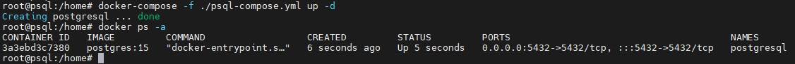
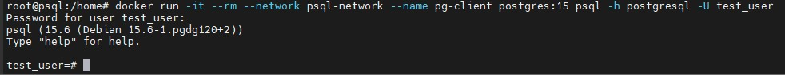

## 1. Создать ВМ с Ubuntu 20.04/22.04 или развернуть докер любым удобным способом
ВМ развернул локально у себя на ноутбуке. Использовал ОС Ubuntu 22.04.4 LTS.
## 2. Поставить на нем Docker Engine
Поставил маскимально высокую версию **docker**, доступную в стандартных репозиториях - 24.0.5. И **docker-compose** версии 1.29.2:  
```
apt install docker.io
apt install docker-compose
```
## 3. Cделать каталог /var/lib/postgres
Под пользователем root создал директорию и выдал на нее максимальные права:  
```
mkdir /var/lib/postgres  
chmod 777 /var/lib/postgres
```
## 4. Развернуть контейнер с PostgreSQL 15 смонтировав в него /var/lib/postgresql
Для начала создал сеть с названием **psql-network** командой:  
```
docker network create psql-network
```
Контенер с **PostgreSQL** решил разворачивать с помощью **docker-compose**, дабы не использовать ``docker run`` со множеством параметров. Клиент PostgreSQL буду разворачивать с помощью ``docker run``.  
Для этого создал **docker-compose** файл с названием ``psql-compose.yml`` и указал там следующие параметры:  
```
version: '3.9'

networks:
  psql-network:
    external: true

services:
  psql:
    image: postgres:15
    container_name: postgresql
    restart: always
    environment:
      - POSTGRES_PASSWORD=1Qwertyu
      - POSTGRES_USER=test_user
      - POSTGRES_DB=test_user
    volumes:
      - type: bind
        source: /var/lib/postgres
        target: /var/lib/postgresql/data
    networks:
      - psql-network
    ports:
      - 5432:5432
```
Далее запустил командой:  
```
docker-compose -f ./psql-compose.yml up -d
```
Проверил корректность запуска командой:  
```
docker ps -a
```
Далее проверил, что в папку ``/var/lib/postgres`` действительно пробросились файлы и папки из контейнера:  
```
ls /var/lib/postgres/
```
Результат выполнения команды:


## 5. Развернуть контейнер с клиентом postgres
Далее запустил контейнер с клиентом с помощью команды:
```
docker run -it --rm --network psql-network --name pg-client postgres:15 psql -h postgresql -U test_user
```
Подключение прошло успешно:


## 6. Подключится из контейнера с клиентом к контейнеру с сервером и сделать таблицу с парой строк
Создал отдельную БД, внутри нее создал БД с 2 столбцами и 1 строкой:  


Листинг:  
```
create database otus_hw1;
\c otus_hw1
create table otus_table_hw1 (id integer, data text);
insert into otus_table_hw1 (id, data) values ('1', 'sergey');
select * from otus_table_hw1;
```
## 7. Подключится к контейнеру с сервером с ноутбука/компьютера извне инстансов GCP/ЯО/места установки докера
Подключился к **PostgreSQL** с ноутбука через **DBeaver** по ip-адресу ВМ:


## 8. Удалить контейнер с сервером
Удалил контейнер с сервером:


Листинг:
```
docker-compose -f ./psql-compose.yml down
docker ps -a
```
## 9. Создать его заново
Создал контейнер заново:  



Листинг:
```
docker-compose -f ./psql-compose.yml up -d
docker ps -a
```
## 10. Подключится снова из контейнера с клиентом к контейнеру с сервером
Подключился снова из контейнера с клиентом к контейнеру с сервером:  



Листинг:
```
docker run -it --rm --network psql-network --name pg-client postgres:15 psql -h postgresql -U test_user
```
## 11. Проверить, что данные остались на месте
Проверил наличие ранее созданных данных: 


Как видно, после пересоздания контейнера данные сохранились.  
Листинг:
```
\c otus_hw1
select * from otus_table_hw1;
```
## 12. Проблемы
В целом, особых проблем при выполнении ДЗ не испытал, так как ранее был опыт работы с **docker**, а также на вебинаре было все достаточно понятно объяснено.