## 1. Создайте виртуальную машину c Ubuntu 20.04/22.04 LTS в GCE/ЯО/Virtual Box/докере
ВМ развернул локально у себя на ноутбуке в **VMware Workstation**. Использовал ОС **Ubuntu 22.04.4 LTS**.

## 2. Поставьте на нее PostgreSQL 15 через sudo apt
Установил **PostgreSQL 15** следующими командами:
```
sudo install -d /usr/share/postgresql-common/pgdg

sudo curl -o /usr/share/postgresql-common/pgdg/apt.postgresql.org.asc --fail https://www.postgresql.org/media/keys/ACCC4CF8.asc

sudo sh -c 'echo "deb [signed-by=/usr/share/postgresql-common/pgdg/apt.postgresql.org.asc] https://apt.postgresql.org/pub/repos/apt $(lsb_release -cs)-pgdg main" > /etc/apt/sources.list.d/pgdg.list'

sudo apt update

sudo apt -y install postgresql-15
```

## 3. Проверьте что кластер запущен через sudo -u postgres pg_lsclusters
После выполнения команды:
```
sudo -u postgres pg_lsclusters
```
Видно, что кластер запущен корректно:  

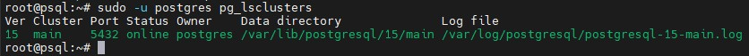

## 4. Зайдите из под пользователя postgres в psql и сделайте произвольную таблицу с произвольным содержимым
Выполнил вход в **PostgreSQL** следующей командой:  
```
sudo -u postgres psql
```
Далее выполнил следующие запросы:
```
postgres=# create table test(c1 text);
postgres=# insert into test values('1');
postgres=# insert into test values('2');
postgres=# select * from test;
```
Скрин выполнения запросов:  

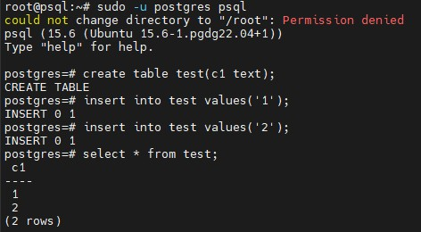

Как видно, все прошло успешно

## 5. Остановите postgres например через sudo -u postgres pg_ctlcluster 15 main stop
Выполнил остановку кластера командой:  
```
pg_ctlcluster 15 main stop
```
Также остановил службу **postgresql.service** командой:
```
systemctl stop postgresql.service
```
Скрин выполнения команд:

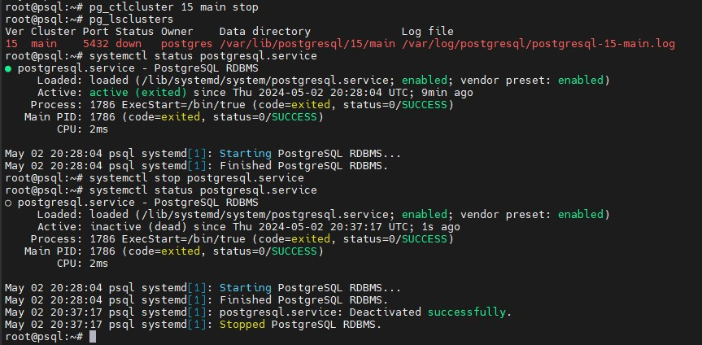

Как видно, отключение PostgreSQL прошло успешно.

## 6. Создайте новый диск к ВМ размером 10GB
Создал диск через оснастку **VMware**

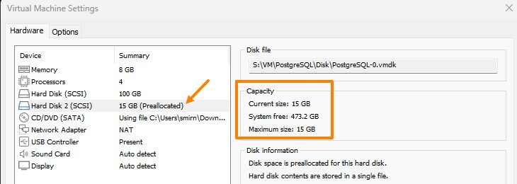

## 7. Добавьте свеже-созданный диск к виртуальной машине
Выполнено в предыдущем пункте.

## 8. Проинициализируйте диск согласно инструкции и подмонтировать файловую систему
Инструкция с **DigitalOcean** не открылась, поэтому шел по другой инструкции. Для начала вывел все данные о дисках, чтобы найти подключенный командой:
```
lsblk
```
В моем случае диск назывался /dev/sdb:

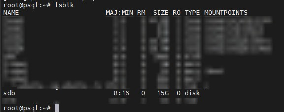

После отформатирвоал диск в формат **EXT4** с помощью команды:
```
mkfs.ext4 /dev/sdb
```
Форматирование прошло успешно:

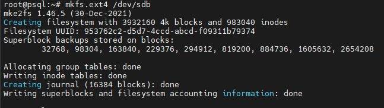

Далее создал папку, куда смонтирую созданный диск командой:
```
mkdir /mnt/data
```
Далее открыл на редактирование конфигурационный файл **fstab** командой:
```
nano /etc/fstab
```
И вставил туда следующую строку:
```
/dev/sdb        /mnt/data       ext4    rw,relatime 0   0
```
После выполнил команду монтирования:
```
mount -a
```
Монтирование прошло успешно.
Также проверил валидность **fstab** командой:
```
findmnt --verify --verbose
```
Все проверки прошли успешно:

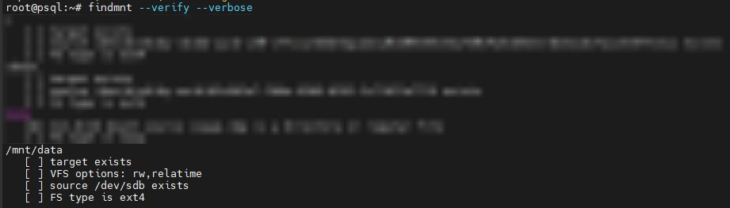

Далее проверил наличие в файловой системе командой:
```
df -h
```
Как видно диск успешно примонтирован:

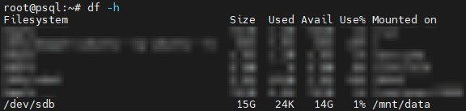

## 9. Перезагрузите инстанс и убедитесь, что диск остается примонтированным
После перезагрузки диск также остался примонтированным:

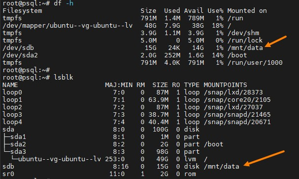

## 10. Сделайте пользователя postgres владельцем /mnt/data
Сделал пользователя postgres владельцем командой:
```
chown -R postgres:postgres /mnt/data/
```
В результате **postgres** стал владельцем папки:

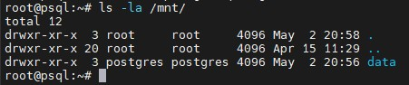

## 11. Перенесите содержимое /var/lib/postgres/15 в /mnt/data 
Выполнил указанную в инструкции команду:
```
mv /var/lib/postgresql/15 /mnt/data
```
Перенос прошел успешно, в папке появились перенесенные файлы:

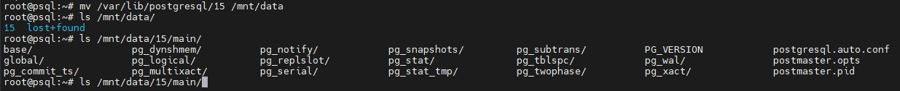

## 12. Попытайтесь запустить кластер
Попытался запустить кластер командой:
```
pg_ctlcluster 15 main start
```
Запуск был завершен с ошибкой, что логично, так как была перенесена директория с данными кластера:

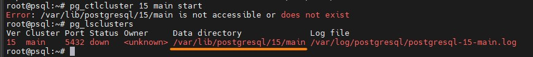

## 13. Задание: найти конфигурационный параметр в файлах раположенных в /etc/postgresql/15/main который надо поменять и поменяйте его. Напишите что и почему поменяли
В данном случае нашел конфигурационный файл postgresql.conf. В нем необходимо было поменять параметр под названием **data_directory**, а конкретно указать путь, куда были перенесены данные из дефолтной папки. В моем случае обновленное значение параметра было таким:

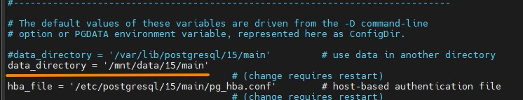

После указания нового значения файл был сохранен.

## 14. Попытайтесь запустить кластер. Напишите получилось или нет и почему. Зайдите через через psql и проверьте содержимое ранее созданной таблицы.
Попытался запустить кластер командой:
```
pg_ctlcluster 15 main start
```
Далее подключился через утилиту **psql** к кластеру командой:
```
sudo -u postgres psql
```
И проверил ранее созданную базу запросом:
```
select * from test;
```
Все прошло успешно:

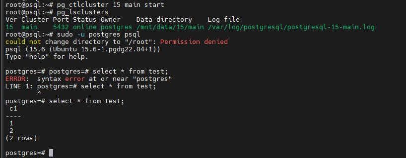

Как видно обновленное значение параметра **data_directory** применилось и кластер был успешно запущен.

## 15. Pадание со звездочкой *: не удаляя существующий инстанс ВМ сделайте новый, поставьте на его PostgreSQL, удалите файлы с данными из /var/lib/postgres, перемонтируйте внешний диск который сделали ранее от первой виртуальной машины ко второй и запустите PostgreSQL на второй машине так чтобы он работал с данными на внешнем диске, расскажите как вы это сделали и что в итоге получилось.

Создал в **VMware** вторую ВМ с названием **psql-rep**. Установил **PostgreSQL-15** также как и в пункте 2. После этого остановил кластер командой:
```
pg_ctlcluster 15 main start
```
Далее на первой ВМ отмонтировал диск командой:
```
umount /dev/sdb
```
Далее первую ВМ выключил и отключил из оснастки VMware от нее дополнительный жесткий диск.  
После этого подключил ранее созданный диск ко второй ВМ. Далее выполнил действия по монтирования нового жесткого диска из пункта 8, кроме команды:
```
mkfs.ext4 /dev/sdb
```
Дабы не затереть данные с диска.  
После успешного монтирования столкнулся с проблемой: диск был пустой. Достаточно долго разбирался с проблемой. Оказалось, что в VMware, видимо, при создании снапшота создается отдельный подобраз диска, содержащий данные с диска на текущий момент времени. Скорее всего это сделано для возоможности отката файловый системы на момент снятия снапшота. Я же ко второй ВМ подключал исходный образ диска, который был актуален на момент ДО снятия первого снапшота, а первый снапшот я сделал как раз перед выполнением команды:  
```
mv /var/lib/postgresql/15 /mnt/data
```
Поэтому диск и был пустой. В общем, разобравшись с проблемой, подключил нужный образ диска к ВМ и перезагрузил ее. Ранее изменения в **fstab** уже вносил, поэтому диск подмонтировался корректно, также на него перенеслись необходимые данные:  

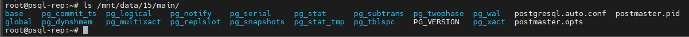

Далее сконфигурировал новый путь в postgresql.conf:

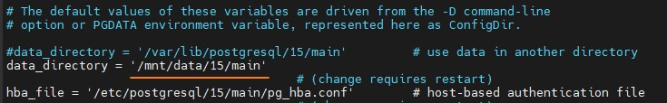

И запустил кластер командой:
```
pg_ctlcluster 15 main start
```
Далее подключился к кластеру и выполнил запрос для проверки наличия ранее созданной таблицы:  

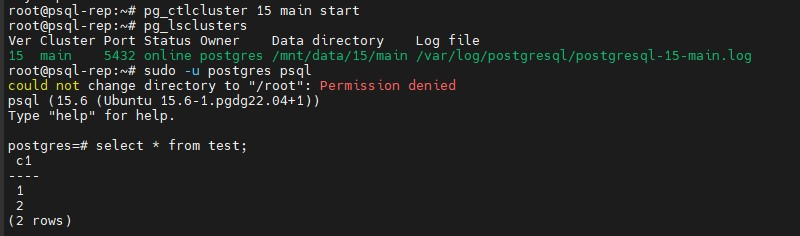

Таблица есть, а значит данные с первого инстанса перенеслись корректно.

По сути, при выполнении этого задания сложностей конкретно с работой на уровне ОС **Linux** и **PostgreSQL** особо не испытал. Единственное, как писал выше, были сложности с переключением диск с одной ВМ на другую на уровне гипервизора.