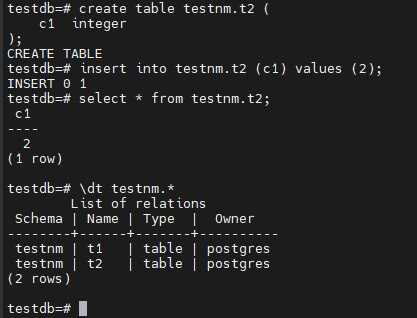

## 1. Cоздайте новый кластер PostgresSQL 14
Развернул **PostgreSQL 14** следующими командами:
```
sudo install -d /usr/share/postgresql-common/pgdg

sudo curl -o /usr/share/postgresql-common/pgdg/apt.postgresql.org.asc --fail https://www.postgresql.org/media/keys/ACCC4CF8.asc

sudo sh -c 'echo "deb [signed-by=/usr/share/postgresql-common/pgdg/apt.postgresql.org.asc] https://apt.postgresql.org/pub/repos/apt $(lsb_release -cs)-pgdg main" > /etc/apt/sources.list.d/pgdg.list'

sudo apt update

sudo apt -y install postgresql-14
```

## 2. Зайдите в созданный кластер под пользователем postgres
Выполнил подключение к кластеру командой:  
```
sudo -u postgres psql
```
Вход прошел успешно:  


## 3. Создайте новую базу данных testdb
Создал базу данных командой:  
```
create database testdb;
```
База создалась успешно:


## 4. Зайдите в созданную базу данных под пользователем postgres
Выполнил подключение к базе данных **testdb** под пользователем **postgres** командой:  
```
\c testdb
```
Подключение прошло успешно:


## 5. Создайте новую схему testnm
Создал схему командой:  
```
create schema testnm;
```
Схема создалась успешно:  


## 6. Создайте новую таблицу t1 с одной колонкой c1 типа integer
Создал новую таблицу с указанными параметрами командой:  
```
create table t1 (
    c1  integer
);
```
Таблица создалась успешно:  


## 7. Вставьте строку со значением c1=1
Вставил строку командой:  
```
insert into t1 (c1) values (1);
```
Строка вставилась успешно:


## 8. Создайте новую роль readonly
Создал новую роль командой:  
```
create role readonly;
```
Роль создана успешно:  


## 9. Дайте новой роли право на подключение к базе данных testdb
Выдал право на подключение командой:  
```
grant connect on database testdb to readonly;
```
Права для роли выданы:  


## 10. Дайте новой роли право на использование схемы testnm
Выдал право на использование роли командой:  
```
grant usage privileges on schema testnm to readonly;
```

Указанные права выдались:  


## 11. Дайте новой роли право на select для всех таблиц схемы testnm
Выдал права на SELECT командой:  
```
grant select on all tables in schema testnm to readonly;
```

Судя по выводу права выдались успешно:  


## 12. Создайте пользователя testread с паролем test123
Создал пользователя командой:  
```
create user testread with password 'test123';
```
Пользователь создан успешно:  


## 13. Дайте роль readonly пользователю testread
Дал роль пользователю командой:  
```
grant readonly to testread;
```
Роль пользователю выдалась успешно:  


## 14. Зайдите под пользователем testread в базу данных testdb
Выполнил подключение командой:  
```
psql -U testread -d testdb -h 192.168.2.100
```
Подключение прошло успешно:  


## 15. Сделайте select * from t1;
Выполнил команду:  
```
select * from t1;
```
Как видно не получилось: 


## 16. Получилось? Могло если вы делали сами не по шпаргалке и не упустили один существенный момент про который позже. Напишите что именно произошло в тексте домашнего задания. У вас есть идеи почему? Ведь права то дали?

Тут проблема скорее всего в пункте:  

> 6. Создайте новую таблицу t1 с одной колонкой c1 типа integer

А именно в выполнении команды:

```
create table t1 (
    c1  integer
);
```
Скорее всего, без явного указания схемы по-умолчанию таблица создается в схеме **public**.
Если посмотреть на список таблиц, то действительно таблица была создана в схеме **public**:


На лекции говорилось о **search_path**. Ну если ввести команду:  
```
SHOW search_path;
```
То в выводе будет указана схема **public**, соответсвенно, таблица была создана в этой схеме на которую права для пользователя **testread** не выдавались:


## 17. Посмотрите на список таблиц. Подсказка в шпаргалке под пунктом 20. А почему так получилось с таблицей (если делали сами и без шпаргалки то может у вас все нормально).
По данным вопросам показал и рассказал в пункте 16

## 18. Вернитесь в базу данных testdb под пользователем postgres
Вернулся под пользователем **postgres** командой:  
```
sudo -u postgres psql
```
Подключение прошло успешно:  


## 19. Удалите таблицу t1
Выполнил удаление таблицы командой:  
```
drop table t1;
```
Удаление прошло успешно:  


## 20. Создайте ее заново но уже с явным указанием имени схемы testnm
Создал таблицу я явным указанием схемы командой:  
```
create table testnm.t1 (
    c1  integer
);
```
Таблица в схеме **testnm** создалась успешно:  


## 21. Вставьте строку со значением c1=1
Вставил строку командой:  
```
insert into testnm.t1 (c1) values (1);
```
Строка вставилась успешно:  


## 22. Зайдите под пользователем testread в базу данных testdb
Зашел под указанным пользователем командой:  
```
psql -U testread -d testdb -h 192.168.2.100
```
Вход прошел успешно:  


## 23. Сделайте select * from testnm.t1
Выполнил указанный запрос:  
```
select * from testnm.t1;
```
Как видно не получилось:  


## 24. Получилось? Есть идеи почему? Если нет - смотрите шпаргалку.
Предположу, что права выдаются на уже существующие таблицы в схеме. При создании новой таблицы, на нее НЕ будут переданы те же права.

UPD: посмотрел в шпаргалке - моя теория верна.

## 25. Как сделать так чтобы такое больше не повторялось? Если нет идей - смотрите шпаргалку
Сам не придумал, но решил загуглить и нашел такое решение: https://stackoverflow.com/questions/19309416/grant-permissions-to-user-for-any-new-tables-created-in-postgresql

Для выдачи прав необходимо использовать запрос:  
```
ALTER DEFAULT PRIVILEGES IN SCHEMA testnm GRANT SELECT ON TABLES TO testread;
```
Который задает стандартные привилегии (SELECT) для всех новосозданных таблиц в схеме.
Подключился снова под пользователем **postgres**:


И выполнил запрос:


Права вроде как выдались успешно.
Далее для проверки решил создать еще одну таблицу в схеме командой:  
```
create table testnm.t2 (
    c1  integer
);
```
И вставить в нее строку:  

```
insert into testnm.t2 (c1) values (2);
```
Все команды выполнились успешно:  



Далее снова подключился под пользователем **testread** и выполнил следующие запросы:  
```
select * from testnm.t1;
select * from testnm.t2;
```
К новосозданной таблице права выдались корректно, а к изначальной прав не хватало:  


Ну и тут логично - запрос:  
```
ALTER DEFAULT PRIVILEGES IN SCHEMA testnm GRANT SELECT ON TABLES TO testread;
```
Получается выдает права только для новосозданных таблиц, а запрос:  
```
grant select on all tables in schema testnm to readonly;
```
только для уже существующих таблиц.  
Поэтому снова подключился под пользователем postgres и выполнил запрос: 
```
grant select on all tables in schema testnm to readonly;
```
Команда выполнилась успешно:  


Далее снова подключился под пользователем **testread** и выполнил SELECT'ы к таблицам:  


Оба запроса выполнились успешно.

UPD: Посмотрел в шпаргалке - в принципе сделал все то же самое. Единственное, в запросе alter default privileges выдал права напрямую пользователю **testread**, а не роли **readonly**. Но думаю в рамках данной ДЗ это не так критично.

## 26. Теперь попробуйте выполнить команду create table t2(c1 integer); insert into t2 values (2)
Попробовал выполнить указанные запросы (поменял номер таблицы на 3, так как t2 уже создавал):  
```
create table t3(c1 integer);
insert into t3 values (3);
```
Таблица создалась и в нее успешно вставилась строка:  


## 27. А как так? нам же никто прав на создание таблиц и insert в них под ролью readonly? Есть идеи как убрать эти права? Если нет - смотрите шпаргалку
Идей не было поэтому посмоторел в шпаргалке. Сначала не заметил, что таблица оказывается создавалась без явного указания схемы, а значит согласно **search_path** в схеме **public**. По поводу роли **public** также не знал, но если бы сразу бы заметил, что таблицы создавались в схеме **public**, то скорее всего сделал верное предположение.  
Но возник вопрос - почему тогда при выполнении пункта 15 запрос:  
```
select * from t1;
```
закончился ошибкой доступа? Тут опытным путем решил проверить:  


А именно создал новую таблицу под пользователем **postgres** в схеме **public**. Далее зашел под пользователем **testread** и выполнил запрос к созданной таблице. Видимо, тут влияет то, кто создал таблицу. Получается, что в схеме **public** по-умолчанию выдаются права только на созданные самим пользователем объекты, если их создал другой пользователь, то тогда доступа к объектам не будет.  

Далее согласно шпаргалке выполнил запросы:  
```
REVOKE CREATE on SCHEMA public FROM public; 
REVOKE ALL on DATABASE testdb FROM public; 
```
Оба запроса выполнились успешно:  


## 28. Теперь попробуйте выполнить команду create table t3(c1 integer); insert into t2 values (2); Расскажите что получилось и почему
Выполнил запросы:  
```
create table t5(c1 integer);
insert into t5 values (2);
```
Ну и прав на выполнение данных операций не было:  


Так произошло потому что первый запрос запрещает создание объектов в схеме **public** для всех пользователей. А второй запрос запрещает все операции в базе данных **testdb** для всех пользователей. У пользователя **testread** права на подключение к БД остались скорее всего из-за того, что мы их ранее выдавали явно.