## 1. Создать инстанс ВМ с 2 ядрами и 4 Гб ОЗУ и SSD 10GBМ
ВМ развернул локально у себя на ноутбуке в **VMware Workstation**. Использовал ОС **Ubuntu 22.04.4 LTS**.  
Использовалась следующая конфигурация ВМ:  

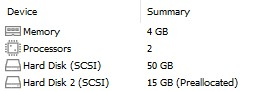

ВМ создавал ранее с SSD 50Гб, поэтому решил не пересоздавать. Думаю, размер чуть больше не критично.


## 2. Установить на него PostgreSQL 15 с дефолтными настройками.
Установил **PostgreSQL 15** следующими командами:
```
sudo install -d /usr/share/postgresql-common/pgdg

sudo curl -o /usr/share/postgresql-common/pgdg/apt.postgresql.org.asc --fail https://www.postgresql.org/media/keys/ACCC4CF8.asc

sudo sh -c 'echo "deb [signed-by=/usr/share/postgresql-common/pgdg/apt.postgresql.org.asc] https://apt.postgresql.org/pub/repos/apt $(lsb_release -cs)-pgdg main" > /etc/apt/sources.list.d/pgdg.list'

sudo apt update

sudo apt -y install postgresql-15
```
**PostgreSQL 15** установлен успешно:  

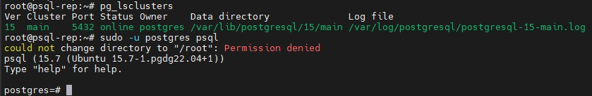

## 3. Создать БД для тестов: выполнить pgbench -i postgres
Создал тестовую БД командой:
```
create database testix;
```
База данных создана успешно:

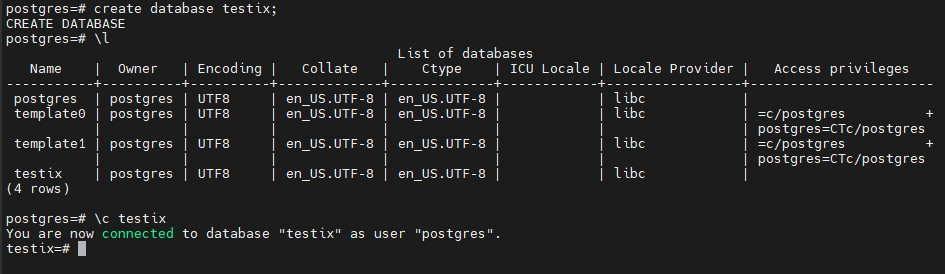

Далее в созданной БД выполнил инициализацию командой:
```
sudo -u postgres pgbench -i testix
```
Инициализация выполнена успешно:  

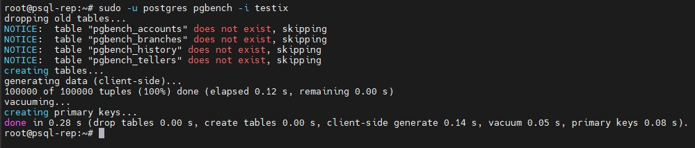

Тестовые таблицы успешно созданы:  

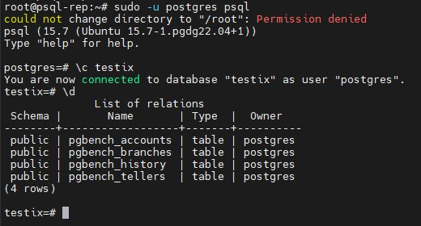

## 4. Запустить pgbench -c8 -P 6 -T 60 -U postgres postgres
Запустил указанную команду с учетом изменений:  
```
sudo -u postgres pgbench -c8 -P 6 -T 300 -U postgres testix
```
Решил указать большое время запуска для полноты результата.  
Результаты:  

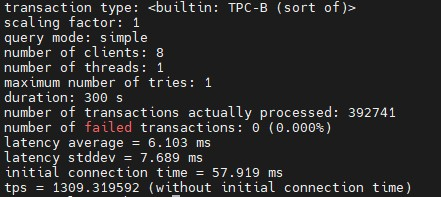

## 5. Применить параметры настройки PostgreSQL из прикрепленного к материалам занятия файла
Указанные параметры применил:  
```
max_connections = 40
shared_buffers = 1GB
effective_cache_size = 3GB
maintenance_work_mem = 512MB
checkpoint_completion_target = 0.9
wal_buffers = 16MB
default_statistics_target = 500
random_page_cost = 4
effective_io_concurrency = 2
work_mem = 6553kB
min_wal_size = 4GB
max_wal_size = 16GB
```
Файл прилагаю: [postgresql.conf](./files/postgresql.conf)  
Перезапустил кластер и проверил работоспособность:  

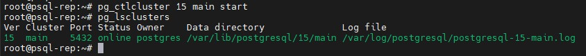

## 6. Протестировать заново
Заново запустил тест командой:  
```
sudo -u postgres pgbench -c8 -P 6 -T 300 -U postgres testix
```
Результаты:  

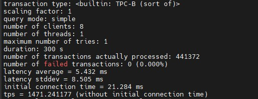

## 7. Что изменилось и почему?
В целом провел несколько тестов, даже увеличил время теста до 5 минут. Зафискировал вот такие результаты:  

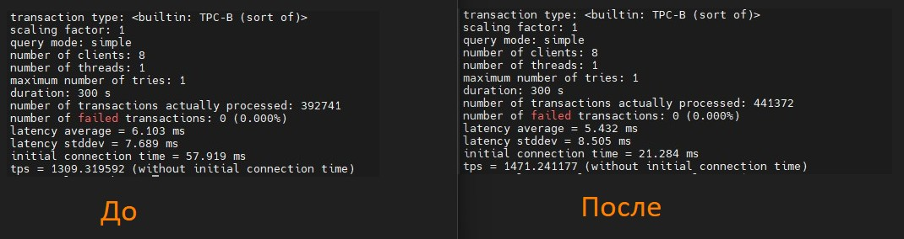

Если посмотреть на количество транзакций в секунду и общее количество транзакций, то после применения параметров скорость обработки транзакций возросла.  
Такое поведение может быть связано с тем, что кластер PostgreSQL "раздушили" и дали для работы большее количество ресурсов. Думаю, большое влияение оказывает увеличение значения параметра **shared_buffers** до 1Гб. Конкретно по другим параметрам сказать не могу, уроки по настройке производительности PostgreSQL еще впереди :)

## 8. Создать таблицу с текстовым полем и заполнить случайными или сгенерированными данным в размере 1млн строк
Создал таблицу и заполнил ее данными командами:  
```
-- Создание
CREATE TABLE randomik(
    id serial,
    name text
);

-- Заполнение
INSERT INTO randomik (name)
SELECT
    md5(random()::text || clock_timestamp()::text)
FROM
    generate_series(1, 1000000);
```
Таблица создалась успешно:

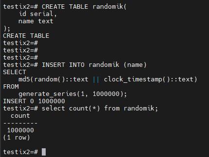

## 9. Посмотреть размер файла с таблицей
Для проверки выполнил следующую команду:  
```
SELECT pg_size_pretty(pg_total_relation_size('randomik'));
```
Размер файла с таблицей равен 65Мб:  

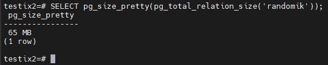


## 10. 5 раз обновить все строчки и добавить к каждой строчке любой символ
Выполнил следующие запросы 5 раз:
```
UPDATE randomik SET name = md5(random()::text || clock_timestamp()::text);
```
Результаты:  

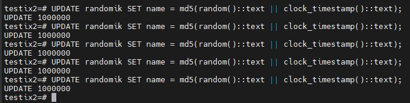

## 11. Посмотреть количество мертвых строчек в таблице и когда последний раз приходил автовакуум
Посмотрел количество мертвых строк и информацию об autovaacum командой:  
```
SELECT relname, n_live_tup, n_dead_tup,
trunc(100*n_dead_tup/(n_live_tup+1))::float AS "ratio%", last_autovacuum
FROM pg_stat_user_tables;
```
Результат:  

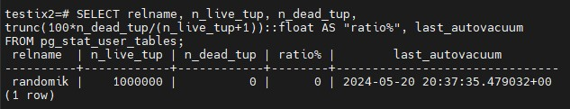

Автовакуум уже прошел поэтому сразу выполнил еще 5 апдейтов и предыдуший запрос:  

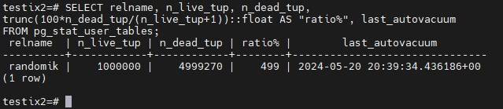

Тут еще мертвые строчки не успели удалиться автоваккумом.

## 12. Подождать некоторое время, проверяя, пришел ли автовакуум
Проверял тем же запросом:
```
SELECT relname, n_live_tup, n_dead_tup,
trunc(100*n_dead_tup/(n_live_tup+1))::float AS "ratio%", last_autovacuum
FROM pg_stat_user_tables;
```
Autovaacum прошел:  

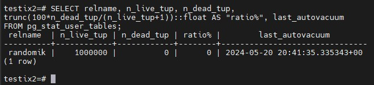

## 13. 5 раз обновить все строчки и добавить к каждой строчке любой символ и посмотреть размер файла с таблицей
Выполнил следующие запросы 5 раз:
```
UPDATE randomik SET name = md5(random()::text || clock_timestamp()::text);
```
И проверил размер файла с таблицей:  

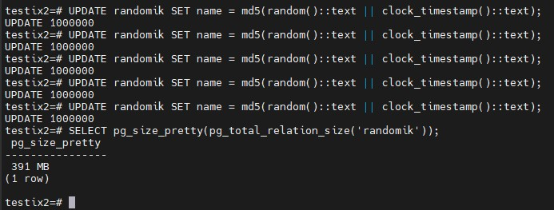

Размер увеличился до 391 Мб.

## 14. Отключить Автовакуум на конкретной таблице
Отключил автоваккум на данной таблице командой:  
```
ALTER TABLE randomik SET (autovacuum_enabled = off);
```
Результат:  

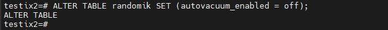

## 15. 10 раз обновить все строчки и добавить к каждой строчке любой символ
Выполнил следующие запросы 10 раз:
```
UPDATE randomik SET name = md5(random()::text || clock_timestamp()::text);
```

Результат:  

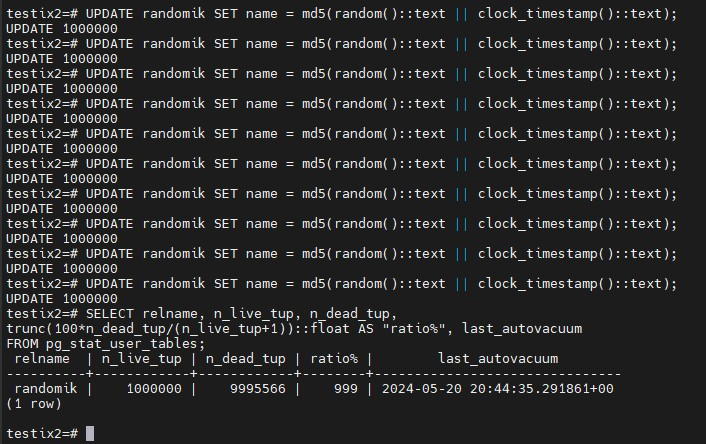

## 16. Посмотреть размер файла с таблицей
Для проверки выполнил следующую команду:  
```
SELECT pg_size_pretty(pg_total_relation_size('randomik'));
```
Размер файла с таблицей равен 716 Мб:

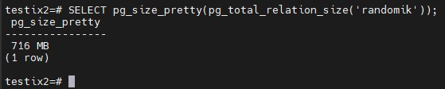

## 17. Объясните полученный результат
Как говорилось в лекции - autovacuum не уменьшает размер таблицы, а только удаляет из нее "мертвые" строчки. Поэтому включен он или нет на размер таблицы не влияет. Поэтому, что при включенном автовакууме размер таблицы увеличивался, что при выключенном тоже, но уже без удаления "мертвых" строк. Для уменьшения размера таблицы и удаления "мертвых" строк необходимо выполнять **VACUUM FULL**.

## 18. Не забудьте включить автовакуум
Включил автовакуум командой:  
```
ALTER TABLE randomik SET (autovacuum_enabled = on);
```

Результат:

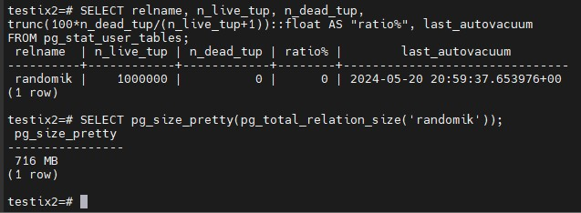