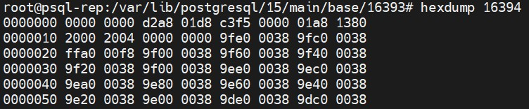

## 1. Создание и подготовка кластера 
Создал ВМ со следующими параметрам:  
**ОЗУ**: 4Гб  
**ЦП**: 2  
**SSD**: 24Гб  
Установил **PostgreSQL 15**:  


## 2. Настройте выполнение контрольной точки раз в 30 секунд
В конфигурационном файле **postgresql.conf** в параметре **checkpoint_timeout** указал значение в 30 секунд:


Остальные параметры оставил по-умолчанию. Далее перезапустил кластер командами:  
```
pg_ctlcluster 15 main stop
pg_ctlcluster 15 main start
```
Кластер перезапущен успешно:  


## 3. 10 минут c помощью утилиты pgbench подавайте нагрузку
Создал и инициализировал тестовую БД командами:
```
create database testix;
sudo -u postgres pgbench -i testix
```
Параметры инициализации оставил стандартные. Результаты:  


Далее запустил **pgbench** со следующими параметрами:  
```
sudo -u postgres pgbench -c 100 -j 2 -P 30 -T 600 testix
```
Количество подключений указал максимально доступное в текущей конфигурации и 2 потока пол количеству процессоров. Также открыл вторую сессию для мониторинга и нагрузки и размера WAL.  
Видно, что нагрузка есть:  


Также видно, что пишутся новые WAL-сегменты:  


Ожидаю окончанию бэнчмарка...  
Результаты следующие:  


## 4. Измерьте, какой объем журнальных файлов был сгенерирован за это время. Оцените, какой объем приходится в среднем на одну контрольную точку.

Сначала объем WAL вычислял грубым способом, а именно ставил большое значение параметра **checkpoint_timeout** и запускал **pgbench**. Далее с помощью команды:  
```
ls -lah /var/lib/postgresql/15/main/pg_wal/
```
Смотрел общий объем папки **pg_wal** и вычитал по принципу: стало - было.  
Но данный способ не подходит при значении параметра **checkpoint_timeout** в 30 секунд, так как чекпоинты выполняются часто и объем WAL держится на минимальном значении из параметра **min_wal_size**, в моем случае по-умолчанию 80 Мб.  
Поэтому решил использовать способ, показанный в лекции. Для этого сначала определили текущий **LSN** командами:  
```
SELECT pg_current_wal_lsn();
SELECT pg_current_wal_insert_lsn();
```
В моем случае значения были следующими:  


Они одинаковы, а значит все изменения были записаны на диск.  
Зафиксировал значение - 0/57268070.  
Далее снова запустил pgbench с теми же параметрами. Результаты:  


Далее подключиился к **psql** и посмотрел текущий **LSN**:


Зафиксировал значение - 0/7D204400.  
Далее с помощью запроса:  
```
SELECT '0/7D204400'::pg_lsn - '0/57268070'::pg_lsn;
```
Узнал разницу **LSN** в байтах. Результат:  


Результат в байтах составил 637125520 или 607,61 Мб. За 10 минут было сделано 20 контрольных точек, то есть, если считать нагрузку равномерной, то на 1 чекпоинт приходится 637125520 / 20 = 31856276 байт или 30,38 Мб.

## 5. Проверьте данные статистики: все ли контрольные точки выполнялись точно по расписанию. Почему так произошло?

Для анализа выполнения контрольных точек включил их логирование. Для этого в файл **postgresql.conf** добавил следующие параметры:  


После этого перезапустил кластер и сразу запустил утилиту **pgbench** с такими же настройками.  
После выполнения бэнчмарка остановил кластер и выгрузил логи по чекпоинтам следующей командой:  
```
cat /var/lib/postgresql/15/main/log/postgresql-2024-07-13.log | grep 'checkpoint' > /home/checkpoint_log.txt
```
Содержимое файла:  


Из него видно, что чекпоинты действительно начинали делаться каждые 30 секунд и завершались спустя 27 секунд после начала. То есть согласно параметру **checkpoint_completion_target = 0.9**. Из лога также видно, что на один чекпоинт приходится примерно 30Мб журналов, что подтверждает вычисления из прошлого задания. В целом, никаких сбоев в расписании выполнения чекпоинтов не увидел. Единственный чекпоинт, который выполнился не по расписанию был чекпоинт, созданный перед остановкой кластера.

## 6. Сравните tps в синхронном/асинхронном режиме утилитой pgbench. Объясните полученный результат

Для начала выполнил бэнчмарк в синхронном режиме и получил следующие результаты:  


Зафиксировал значение **tps** - 1080.270768.  
Далее выключил синхронный режим. Для этого в конфигурационном файле **postgresql.conf** и нашел параметр **synchronous_commit** и указал значение **off**:  


После этого перезапустил кластер и запустил **pgbench** с теми же параметрами. Результаты:  


**tps** повысился с 1080.270768 до 1575.560223, то есть примерно в 1,5 раза.

Данное поведение связано с тем, что в режиме off ожидание сброса WAL на диск отсутствует, клиент узнает о завершении транзакции раньше, чем в синхронном режиме, следовательно, возрастает скорость обработки транзакций, но гарантия сохранности каждой транзакции не обеспечивается.

## 7. Создайте новый кластер с включенной контрольной суммой страниц. Создайте таблицу. Вставьте несколько значений. Выключите кластер. Измените пару байт в таблице. Включите кластер и сделайте выборку из таблицы. Что и почему произошло? как проигнорировать ошибку и продолжить работу?

Текущий кластер не удалял, с 12 версии можно включать и на уже созданном кластере утилитой **pg_checksums**.  
Сначала проверил, что контрольные суммы выключены командой:  
```
SHOW data_checksums;
```
Результат:  


Далее остановил кластер командой:  
```
pg_ctlcluster 15 main stop
```
И включил контрольные суммы для данного кластера командой:  
```
sudo -u postgres /usr/lib/postgresql/15/bin/pg_checksums -e /var/lib/postgresql/15/main
```
Результат:  


Далее запустил кластер командой:  
```
pg_ctlcluster 15 main start
```
И снова проверил включены ли контрольные суммы:  


Как видно, контрольные суммы для данного кластер успешно включены.  
Далее создал базу данных **checksums** для теста. Создал в ней таблицу **test** и добавил в нее 100 строк следующими командами:  
```
CREATE DATABASE checksums;
\c checksums
INSERT INTO test SELECT s.id FROM generate_series(1,100) AS s(id);
SELECT * FROM test limit 10;
```
Результат:  


Далее узнал физическое расположение таблицы командой:  
```
SELECT pg_relation_filepath('public.test');
```
Результат:  


Далее выключил кластер:  


С помощью утилиты **hexdump** посмотрел содержимое файла таблицы:  


Далее с помощью утилиты **hexedit** изменил пару байт. Вот что получилось:



Далее запустил кластер и сделал выборку из таблицы:  


Ошибка произошла потому что расчитанная контрольная сумма 62812 не равна ожидаемой 50165, то есть данные были изменены или повреждены.  
Чтобы игнорировать подобные ошибки необходимо активировать параметр **ignore_checksum_failure** в конфигурационном файле **postgresql.conf**. Добавил этот параметр в конец файла:  


Далее перезапустил кластер и проверил, что параметр активирован:  


И попробовал сделать выборку из таблицы:  


Теперь ошибка игнорируется, но, судя по выборке, данные все таки были повреждены.