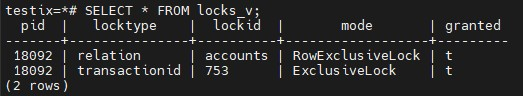

## 1. Создание и подготовка кластера 
Создал ВМ со следующими параметрам:  
**ОЗУ**: 16Гб  
**ЦП**: 8  
**SSD**: 25Гб  
Установил **PostgreSQL 15**:  


## 2. Настройте сервер так, чтобы в журнал сообщений сбрасывалась информация о блокировках, удерживаемых более 200 миллисекунд. Воспроизведите ситуацию, при которой в журнале появятся такие сообщения.
Как я понял, под журналом сообщений имеются ввиду лог-файлы. Поэтому для настройки логирования по заданию использовал конфигурационный файл **postgresql.conf**. В нем добавил следующие настройки:  
```
logging_collector = on
log_directory = 'log'
log_filename = postgresql-%Y-%m-%d.log
log_lock_waits = on
deadlock_timeout = 200ms
```
После этого перезапустил кластер командами:  
```
pg_ctlcluster 15 main stop
pg_ctlcluster 15 main start
```
И проверил, применились ли настройки следующей командой:  
```
select * from pg_file_settings;
```
Настройки применились, результаты:  


Далее необходимо воспроизвести какую-нибудь блокировку. Для этого создал тестовую БД и таблицу следующими запросами:
```
CREATE DATABASE testix;
\c testix
CREATE TABLE accounts(
  acc_no integer PRIMARY KEY,
  amount numeric
);
INSERT INTO accounts VALUES (1,1000.00), (2,2000.00), (3,3000.00);
SELECT * FROM accounts LIMIT 10;
```
Создание прошло успешно:


Для воспроизведения такой блокировки буду использовать **VACUUM FULL**. Для этого открыл вторую сессию в терминале. В первой сессии начал транзакцию и запустил следующий **SELECT**:
```
BEGIN;
SELECT * FROM accounts;
```
Во второй сессии также начал транзакию и сымитировал **VACUUM FULL** слудющими запросами:
```
BEGIN;
LOCK TABLE accounts;
```
После запуска команды произошла блокировка:  


В первой сессии смотрим представление **pg_locks** следующим запросом:
```
SELECT locktype, mode, granted, pid, pg_blocking_pids(pid) AS wait_for FROM pg_locks WHERE relation = 'accounts'::regclass;
```
Результаты:


Тут видно, что команда **LOCK TABLE** (как имитация **VACUUM FULL**) запрашивает блокировку типа Access Exclusive, но данная таблица уже заблокирована блокировкой Access Share, которую вызвал оператор **SELECT**.  
Далее завершил транзакцию в первой сессии:  
```
COMMIT;
```
Во второй сессии команда **LOCK TABLE** выполнилась:  


В первой сессии снова обратился к представлению **pg_locks**, тут видно, что теперь на таблицу наложена только одна блокировка типа Access Exclusive:  


Далее сымитировал обратную ситуацию и попытался сделать **SELECT** при уже наложенной блокировки типа Access Exclusive. Ожидаемо, **SELECT** был заблокирован:  


Во второй сессии обратился к представлению **pg_locks** и увидел обратную ситуацию:  


Далее завершил изменения во второй и первой сессии запросом:  
```
COMMIT;
```
Все блокировки с таблицы были сняты:  


Далее давайте обратимся к журналам **PostgreSQL** для просмотра информации о блокировках. В них появились вся информация о том, какие таблицы какими блокировки в какое время были заблокированы:


## 3. Смоделируйте ситуацию обновления одной и той же строки тремя командами UPDATE в разных сеансах. Изучите возникшие блокировки в представлении pg_locks и убедитесь, что все они понятны. Пришлите список блокировок и объясните, что значит каждая.
Для этого открыл 3 сессии в терминале. Для примера использовал ту же БД и ту же таблицу. Для обновления использовал следующий запрос:  
```
UPDATE accounts
SET amount = amount + 100
WHERE acc_no = 2;
```
Также для просмотра блокировок использовал следующее представление из статьи https://habr.com/ru/companies/postgrespro/articles/463819/:
```
CREATE VIEW locks_v AS
SELECT pid,
       locktype,
       CASE locktype
         WHEN 'relation' THEN relation::regclass::text
         WHEN 'transactionid' THEN transactionid::text
         WHEN 'tuple' THEN relation::regclass::text||':'||tuple::text
       END AS lockid,
       mode,
       granted
FROM pg_locks
WHERE locktype in ('relation','transactionid','tuple')
AND (locktype != 'relation' OR relation = 'accounts'::regclass);
```
Далее во всех трех сессиях начал транзакцию запросом:  
```
BEGIN;
```
В первой сессии запустил обновление строки:  


Сразу посмотрел представление **locks_v**:  
```
SELECT * FROM locks_v;
```
Вывод был следующий:  



Далее выполнил **UPDATE** во второй сессии, результат следующий:  


Как видно, **UPDATE** заблокировался.  
Посмотрел представление **locks_v**:  


Далее выполнил **UPDATE** во третий сессии, запрос также был заблокирован. После этого снова обратился к представлению **locks_v**:


Итого мы получили 3 транзакции, которые пытаются обновить одну строку. При этом 2 из них заблокированы. Теперь необходимо разобраться в списке получившихся блокировок.  
По первым 3 блокировкам:  
```
18314 | relation      | accounts   | RowExclusiveLock | t
18092 | relation      | accounts   | RowExclusiveLock | t
17422 | relation      | accounts   | RowExclusiveLock | t
```
В целом все понятно. Они накладываются оператором **UPDATE** на таблицу целиком. Блокировки имеют тип Row Exclusive и, согласно таблице, друг друга не блокируют.  
Далее рассмотрим следующие 3 блокировки типа **transactionid**:  
```
 18092 | transactionid | 753        | ExclusiveLock    | t
 17422 | transactionid | 754        | ExclusiveLock    | t
 18314 | transactionid | 755        | ExclusiveLock    | t
```
Блокировки типа **transactionid** говорят о том, что каждая транзакция сама удерживает исключительную блокировку своего собственного номера.  
Далее рассмотрим следующую блокировку:  
```
17422 | transactionid | 753        | ShareLock        | f
```
Она говорит о том, что транзакция, запущенная во второй сессии пытается получить Share блокировку к транзакции, запущенной в первой сессии (tid 753). На tid 753 уже наложена блокировка типа Exclusive, поэтому вторая транзакция блокируется.  
Далее рассмотрим следующие блокировки:  
```
17422 | tuple         | accounts:5 | ExclusiveLock    | t
18314 | tuple         | accounts:5 | ExclusiveLock    | f
```
Данные блокировки относятся к транзакциям из 2 и 3 сессии. Если снова обратиться к статье https://habr.com/ru/companies/postgrespro/articles/463819/, то во время обновляения транзакция совершает следующие действия:  
1. Захватывает исключительную блокировку изменяемой версии строки (tuple).
2. Если xmax и информационные биты говорят о том, что строка заблокирована, то запрашивает блокировку номера транзакции xmax.
3. Прописывает свой xmax и необходимые информационные биты.
4. Освобождает блокировку версии строки.

Первая транзакция прошла все 4 этапа. Вторая транзакция была заблокирована на 2 этапе, о чем свидетельствует следующая блокировка:  
```
17422 | transactionid | 753        | ShareLock        | f
```
Третья транзакция была заблокирована на 1 этапе, так как изменяемая версия строки была заблокирована второй транзакцией блокировкой типа Exclusive:
```
17422 | tuple         | accounts:5 | ExclusiveLock    | t
```
Ну и, соотвественно, строка о блокировке 3 транзакции:  
```
18314 | tuple         | accounts:5 | ExclusiveLock    | f
```
Итого у нас получилась некая цепочка блокировок. При коммите первой транзакции, вторая транзакция дойдет до 4 этапа, а третья транзакция застрянет на 2. Для проверки выполним **COMMIT** впервой транзакции:  


**UPDATE** во второй транзакции завершился. Снова посмотрим представление **locks_v**:


Теперь третья транзакция пытается получить Share блокировку на **transactionid** второй транзакции. Получилось по аналоги с первой и второй транзакцией ранее. При коммите второй транзакции, **UPDATE** в 3 транзакции также завершится и блокировка будет снята.

## 4. Воспроизведите взаимоблокировку трех транзакций. Можно ли разобраться в ситуации постфактум, изучая журнал сообщений?
Перед тестирование поставил следующей значение параметра:  
```
deadlock_timeout = 60s
```
Чтобы после взаимоблокировки транзакция не завершилась слишком быстро. Проверка:  


Для воспроизведения взаимоблокировки использовал следующую комбинацию команд:  
Сессия 1:
```
BEGIN;
UPDATE accounts SET amount = amount - 100 WHERE acc_no = 1;
UPDATE accounts SET amount = amount + 100 WHERE acc_no = 2;
```
Сессия 2:
```
BEGIN;
UPDATE accounts SET amount = amount - 200 WHERE acc_no = 3;
UPDATE accounts SET amount = amount + 200 WHERE acc_no = 2;
```
Сессия 3:
```
BEGIN;
UPDATE accounts SET amount = amount - 500 WHERE acc_no = 3;
ROLLBACK;
```
Сессия 1:
```
UPDATE accounts SET amount = amount + 100 WHERE acc_no = 3;
```
В итоге получилась взаимоблокировка:  
Сессия 1:  


Сессия 2: 


Сессия 3:


Спустя 1 минуту во 2 сессии появилось сообщение о взаимоблокировке:  


Откатим все транзакции:  
```
ROLLBACK;
```
И посмотрим логи:  


Информация по взаимоблокировке имеется, а значит и разобраться в ситуации по логам в целом можно.

## 5. Могут ли две транзакции, выполняющие единственную команду UPDATE одной и той же таблицы (без where), заблокировать друг друга? *Попробуйте воспроизвести такую ситуацию.
К ответу на вопрос пришел не сам, нашел на Habr в статье: https://habr.com/ru/companies/postgrespro/articles/465263/
Ответ таков:  
*Если одна команда будет обновлять строки в одном порядке, а другая — в другом, они могут взаимозаблокироваться.*  
Воспроизвел также не сам, воспользовался следующим примером: https://github.com/radchenkoam/OTUS-postgres-2020-05/issues/7#issuecomment-673081328 и немного адаптировал под созданную мною ранее таблицу. Получился вот такой порядок действий:  
Сессия 1:
```
BEGIN;
DECLARE cur1 CURSOR FOR
SELECT * FROM accounts
ORDER BY acc_no FOR UPDATE;
```
Сессия 2:
```
BEGIN;
DECLARE cur2 CURSOR FOR
SELECT * FROM accounts
ORDER BY acc_no DESC FOR UPDATE;
```

Сессия 1:
```
FETCH cur1;
```

Сессия 2:
```
FETCH cur2;
```

Сессия 1:
```
FETCH cur1;
```

Сессия 2:
```
FETCH cur2;
```

Сессия 1:
```
FETCH cur1;
```
Результаты сессия 1:  


Результаты сессия 2:  


По итогу спустя 60 секунд в сессии 2 появилась информация о взаимоблокировке:  


В итоге получилась имитация ситуации, когда один **UPDATE** идет сверху вниз по таблице, а другой **UPDATE** снизу вверх. Во второй сессии происходит блокировка на второй строке, которая ранее была заблокирована в первой сессии. В первой сессии происходит блокировка на третьей строке, которая ранее была заблокирована во второй сессии.