## 1. Развернуть виртуальную машину любым удобным способом
ВМ развернул локально у себя на ноутбуке в **VMware Workstation**. Использовал ОС **Ubuntu Server 22.04.4 LTS**.  
Использовалась следующая конфигурация ВМ:  
**ОЗУ**: 16Гб  
**ЦП**: 8  
**SSD**: 25Гб  

## 2. Поставить на неё PostgreSQL 15 любым способом
Установил **PostgreSQL 15** следующими командами:
```
sudo install -d /usr/share/postgresql-common/pgdg

sudo curl -o /usr/share/postgresql-common/pgdg/apt.postgresql.org.asc --fail https://www.postgresql.org/media/keys/ACCC4CF8.asc

sudo sh -c 'echo "deb [signed-by=/usr/share/postgresql-common/pgdg/apt.postgresql.org.asc] https://apt.postgresql.org/pub/repos/apt $(lsb_release -cs)-pgdg main" > /etc/apt/sources.list.d/pgdg.list'

sudo apt update

sudo apt -y install postgresql-15
```
**PostgreSQL 15** установлен успешно:  

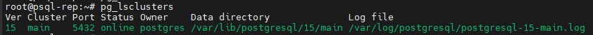

## 3. Настройка pgbench и тестовый замер
Для начала решил замерить значение **tps** на дефолтных настройках с помощью **pgbench**. Создал и инициализировал тестовую БД командами:
```
create database testix;
sudo -u postgres pgbench -i testix
```
Параметры инициализации оставил стандартные. Результаты:  

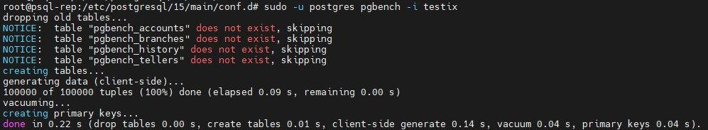

Далее запустил **pgbench** со следующими параметрами:  
```
sudo -u postgres pgbench -c 100 -j 8 -P 30 -T 300 testix
```
Количество клиентов указал максимально возможное в текущей конфигурации, количество потоков 8 по количеству ядер процессора.  
Исходное значение tps получено:  

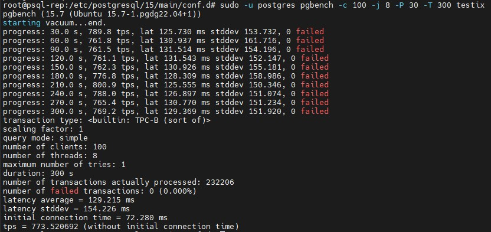

Зафиксировал - 773.520692
Количество выполненных транзакций - 232206

## 4. Настроить кластер PostgreSQL 15 на максимальную производительность не обращая внимание на возможные проблемы с надежностью в случае аварийной перезагрузки виртуальной машины
В качестве точки входа решил воспользоваться **PgTune** для конфигурации своего кластера. Исходя из конфигурации ВМ получились такие параметры:  
```
max_connections = 100
shared_buffers = 4GB
effective_cache_size = 12GB
maintenance_work_mem = 1GB
checkpoint_completion_target = 0.9
wal_buffers = 16MB
default_statistics_target = 100
random_page_cost = 1.1
effective_io_concurrency = 200
work_mem = 5242kB
huge_pages = off
min_wal_size = 1GB
max_wal_size = 4GB
max_worker_processes = 8
max_parallel_workers_per_gather = 4
max_parallel_workers = 8
max_parallel_maintenance_workers = 4
```
Также, исходя из задания, добавил следующие параметры, воспользовавшись рекомендациями из документации: https://postgrespro.ru/docs/postgresql/15/non-durability. Проставил такие значения:  
```
synchronous_commit = off
fsync = off
full_page_writes = off
checkpoint_timeout = 12h
checkpoint_completion_target = 0.5
```
Значение **off** параметра **synchronous_commit** отключает принудительную запись WAL на диск при фиксации транзакции, что позволяет ускорить выполнение запросов, но при это возникает риск потери данных при сбое. В нашем случае это и нужно, поэтому можно отключать.  
Значение **off** параметра **fsync** отключает сброс данных из файлового кэша ОС на диск после каждого завершения транзакции. Отключение этого параметра также ускоряет обработку транзакций, но при сбое возможно потеря или повреждение данных. То что нужно, поэтому отключаем.  
Значение **off** параметра **full_page_writes** отключает запись в WAL всего содержимого каждой страницы памяти при первом изменении этой страницы после контрольной точки. Отключил этот параметр, так как это имеет смысл при отключении **fsync**.
В параметрах **max_wal_size** и **checkpoint_timeout** указал большие значения, чтобы снизить частоту выполнения контрольных точек.  

## 4. Нагрузить кластер через утилиту через утилиту pgbench. Написать какого значения tps удалось достичь, показать какие параметры в какие значения устанавливали и почему.
После настройки перезапустил кластер и запустил **pgbench** с теми же параметрами. Получил следующие результаты бэнчмарка:  

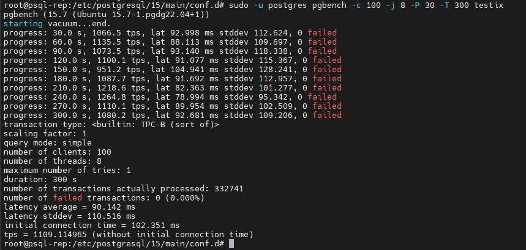

Зафиксировал **tps** - 1109.114965  
Количество выполненных транзакций - 332741  
В моем случае после указания настроек производительность кластера возросла примерно в 1,5 раза.  

## 5. Задание со *: аналогично протестировать через утилиту sysbench
Установил **sysbench** по инструкции из вебинара. Для этого использовал команды:  
```
curl -s https://packagecloud.io/install/repositories/akopytov/sysbench/script.deb.sh | sudo bash

sudo apt -y install sysbench

sysbench --version
```
**sysbench** успешно установлен:  

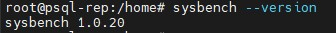

Далее по инструкции создал тестовые БД и пользователя:  
```
CREATE USER sbtest WITH PASSWORD 'password';
CREATE DATABASE sbtest;
GRANT ALL PRIVILEGES ON DATABASE sbtest TO sbtest;
```
Далее в конфигурационный файл **pg_hba.conf** добавил следующую строку:  

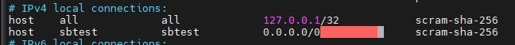

И перезапустил кластер командами:  
```
pg_ctlcluster 15 main stop
pg_ctlcluster 15 main start
```
Далее проверил подключение под созданным пользователем командой:  
```
sudo -u postgres psql -U sbtest -h localhost -p 5432 -d sbtest -W
```
Подключение успешно:  

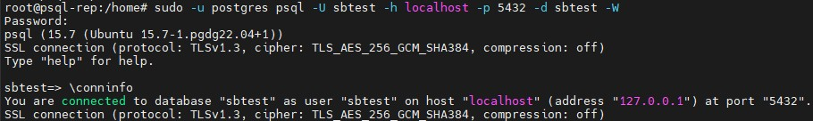

Далее инициализировал БД командой:  
```
/usr/bin/sysbench \
--db-driver=pgsql \
--oltp-table-size=100000 \
--oltp-tables-count=24 \
--threads=1 \
--pgsql-host=localhost \
--pgsql-port=5432 \
--pgsql-user=sbtest \
--pgsql-password=password \
--pgsql-db=sbtest \
/home/sysbench-1.0.15/tests/include/oltp_legacy/parallel_prepare.lua \
run
```
По какой-то причине файлы тестов на **lua** не подтянулись при установке и выполнение команды вызывало ошибку. Для исправления скачал исходники https://github.com/akopytov/sysbench/archive/refs/tags/1.0.20.tar.gz и напрямую скопировал оттуда тесты в директорию **/usr/share/sysbench**. После этого процесс инициализации пошел и завершился успешно:  

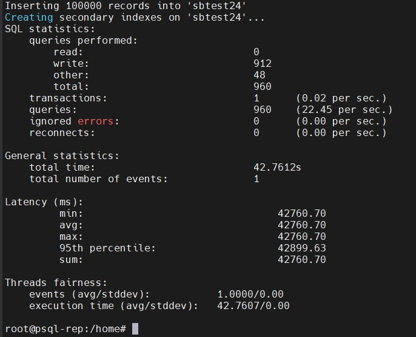

Таблицы также были созданы:  

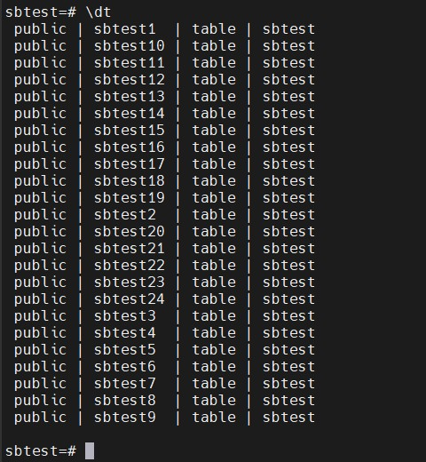

Перед первым тестом откатил настройки кластера PostgreSQL к дефолтным и перезапустил кластер. Далее выполнил первый тест из инструкции, постарался сделать его аналогичным тому, который запускал в **pgbench**:  
```
/usr/bin/sysbench \
--db-driver=pgsql \
--report-interval=30 \
--oltp-table-size=100000 \
--oltp-tables-count=24 \
--threads=8 \
--time=300 \
--pgsql-host=localhost \
--pgsql-port=5432 \
--pgsql-user=sbtest \
--pgsql-password=password \
--pgsql-db=sbtest \
/usr/share/sysbench/tests/include/oltp_legacy/oltp.lua \
run
```
В **htop** видно, что ВМ сильно нагрузилась:  

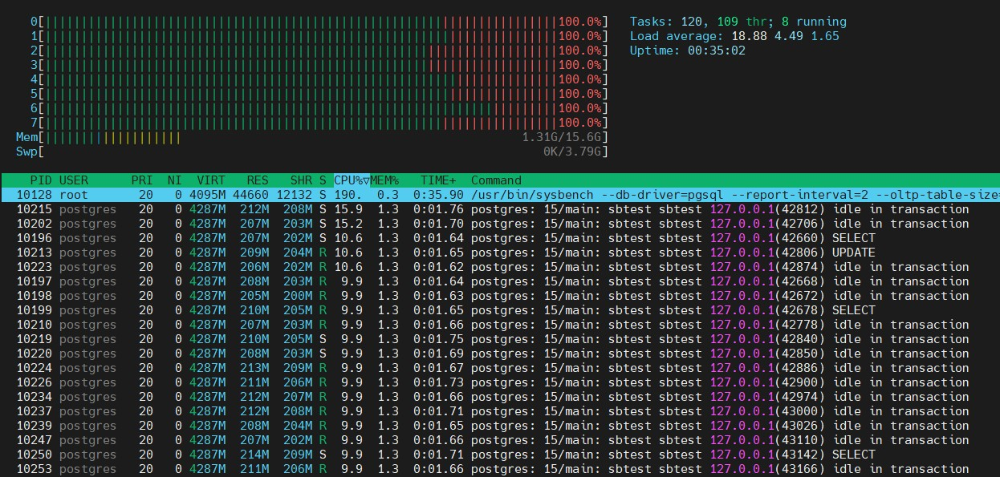

Результаты бэнчмарка:  

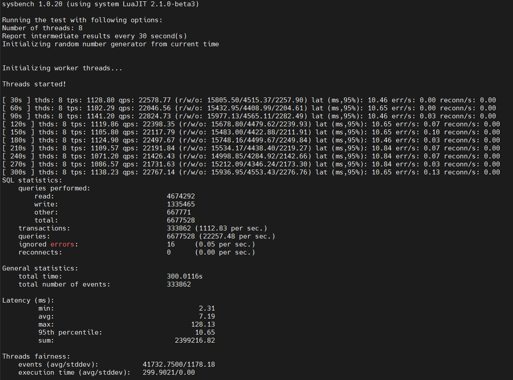

Зафиксировал:  
Количество транзакций: 333862 (tps 1112.83)  
Количество запросов: 6677528 (qps 22257.48)    
Далее переконфигурировал кластер на высокую производительность и перезапустил. Снова запустил **sysbench** с такими же параметрами. Результат получился такой:  

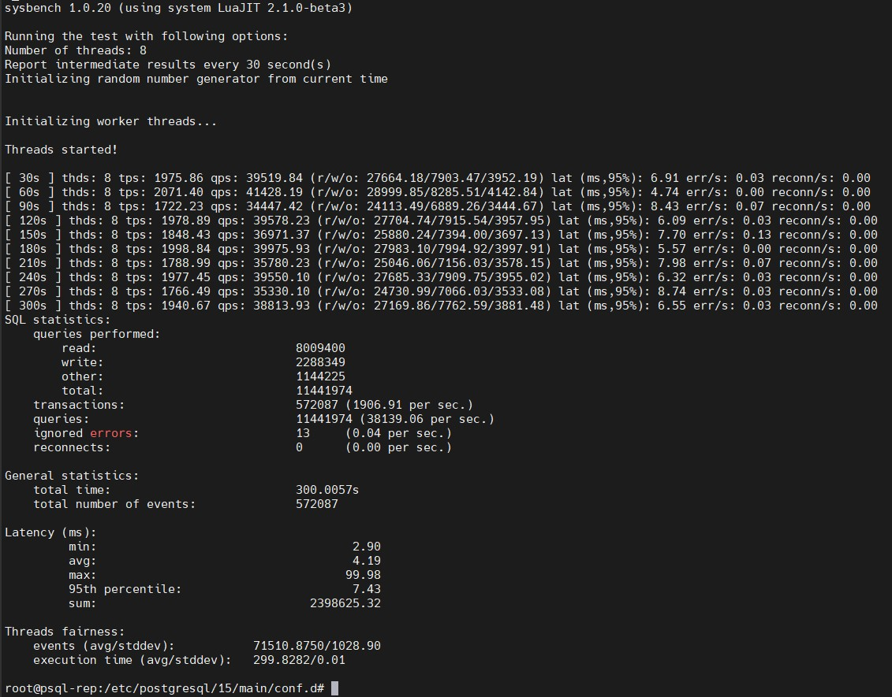

Зафиксировал:  
Количество транзакций: 572087 (tps 1906.91)  
Количество запросов: 11441874 (qps 38139.06)  
То есть, если опираться на **sysbench** производительность после изменения параметров возрасла примерно в 1,7 раз.  
Далее дополнительно попробовал дать нагрузку только на чтение **SELECT**. Для этого использовал соответствующий скрипт и команду:  
```
/usr/bin/sysbench \
--db-driver=pgsql \
--report-interval=30 \
--oltp-table-size=100000 \
--oltp-tables-count=24 \
--threads=8 \
--time=300 \
--pgsql-host=localhost \
--pgsql-port=5432 \
--pgsql-user=sbtest \
--pgsql-password=password \
--pgsql-db=sbtest \
/usr/share/sysbench/tests/include/oltp_legacy/select.lua \
run
```
На дефолтных настройках кластера получились такие результаты:  

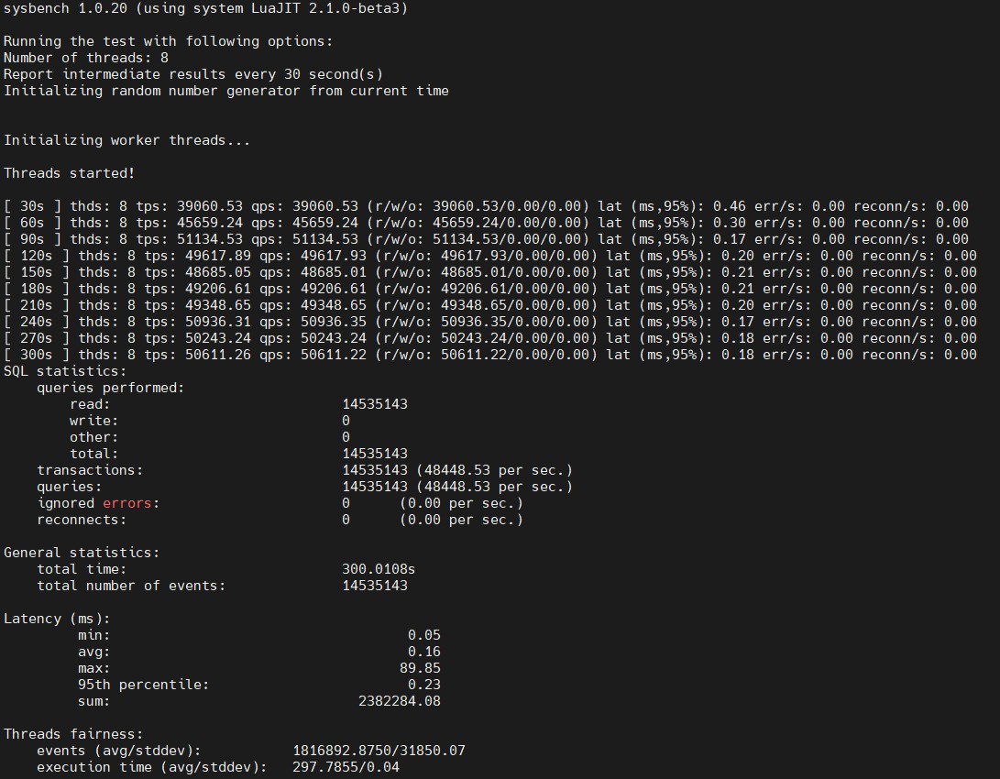

На кастомных настройках кластера получились такие результаты:  

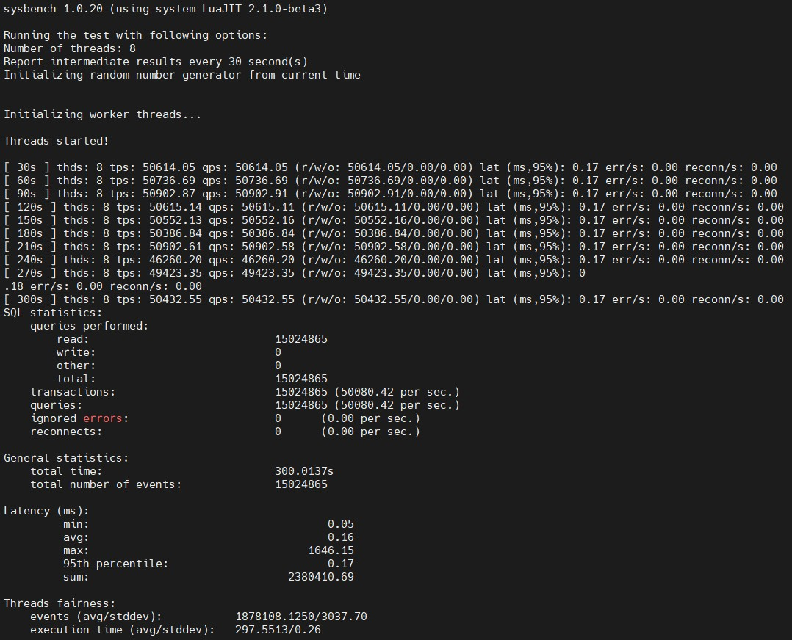

Как видно, в плане выполнения простых запросов на чтение разница в **tps** небольшая.
