## 1. Создаем ВМ/докер c ПГ.
ВМ развернул локально у себя на ноутбуке в **VMware Workstation**. Использовал ОС **Ubuntu Server 22.04.4 LTS**.  
Использовалась следующая конфигурация ВМ:  
**ОЗУ**: 16Гб  
**ЦП**: 8  
**SSD**: 25Гб  

Установил **PostgreSQL 15** следующими командами:
```
sudo install -d /usr/share/postgresql-common/pgdg

sudo curl -o /usr/share/postgresql-common/pgdg/apt.postgresql.org.asc --fail https://www.postgresql.org/media/keys/ACCC4CF8.asc

sudo sh -c 'echo "deb [signed-by=/usr/share/postgresql-common/pgdg/apt.postgresql.org.asc] https://apt.postgresql.org/pub/repos/apt $(lsb_release -cs)-pgdg main" > /etc/apt/sources.list.d/pgdg.list'

sudo apt update

sudo apt -y install postgresql-15
```
**PostgreSQL 15** установлен успешно:  

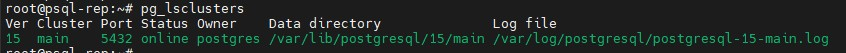

## 2. Создаем БД, схему и в ней таблицу, заполним таблицы автосгенерированными 100 записями.
Подключился к **psql** командой:  
```
sudo -u postgres psql
```
Создал БД, схему, таблицу и сразу сгенерировал в ней записи следующими командами:
```
CREATE DATABASE testix;
\c testix
CREATE SCHEMA my;
CREATE TABLE my.students AS SELECT generate_series(1, 100) AS id, md5(random()::text)::char(10) AS fio;
```
Все создано успешно:

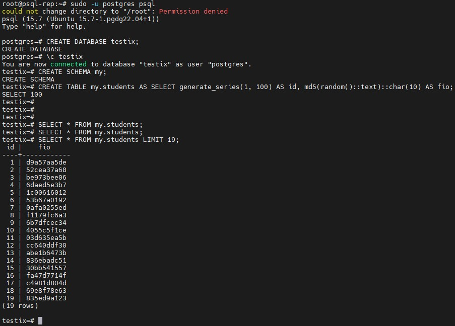

## 3. Под линукс пользователем Postgres создадим каталог для бэкапов
Создал каталог для бэкапов следующей командой:
```
sudo -u postgres mkdir /POSTGRES/pg_backup
```
Каталог успешно создан:

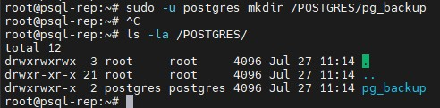

## 4. Сделаем логический бэкап используя утилиту COPY
Выполнил бэкап созданной ранее таблицы следующей командой:  
```
\copy my.students to '/POSTGRES/pg_backup/students_1.sql';
```
Проверил содержимое созданного файла следующей командой:
```
cat /POSTGRES/pg_backup/students_1.sql | head -n 10
```
Бэкап таблицы был создан успешно:

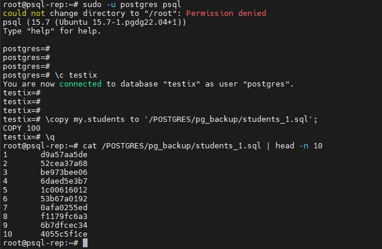

## 5. Восстановим в 2 таблицу данные из бэкапа.
Создал вторую таблицу командой:
```
CREATE TABLE my.students_back (
     id    integer,
     fio   text
);
```
Восстановил в нее бэкап первой таблицы командой:
```
\copy my.students_back from '/POSTGRES/pg_backup/students_1.sql';
```
Восстановление прошло успешно, таблицы идентичны:

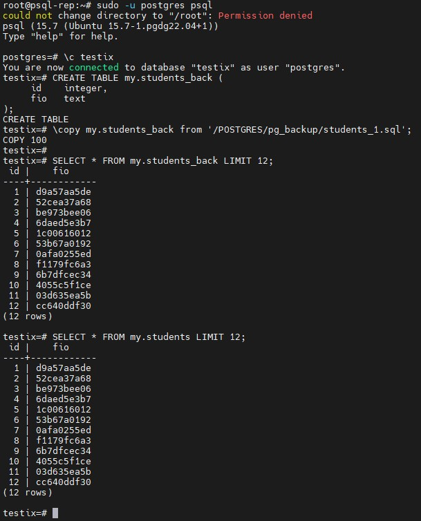

## 6. Используя утилиту pg_dump создадим бэкап в кастомном сжатом формате двух таблиц
Создал бэкап всех таблиц в схеме **my** в кастомном формате командой:
```
sudo -u postgres pg_dump -d testix -t 'my.*' -Fc > /POSTGRES/pg_backup/testix_dump.gz
```
Бэкап в сжатом формате создан успешно:

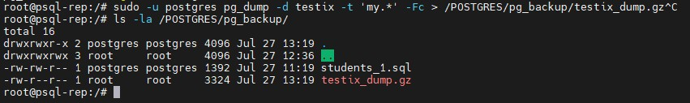

## 7. Используя утилиту pg_restore восстановим в новую БД только вторую таблицу!
Создал новую БД и схему в ней командами:
```
CREATE DATABASE testix_back;
\с testix_back
CREATE SCHEMA my;
```
Все создано успешно:

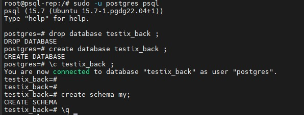

Далее с помощью **pg_restore** восстановил одну таблицу в новую БД следующей командой:
```
sudo -u postgres pg_restore -d testix_back -t students_back /POSTGRES/pg_backup/testix_dump.gz
```
Восстановление одной таблицы прошло успешно:  

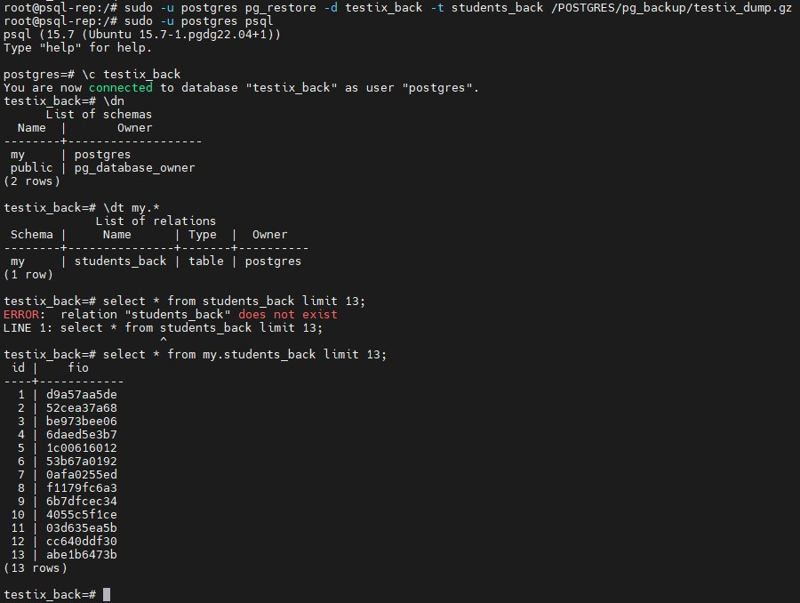

Полноценного обходного решения вместо ручного создания схемы в БД найти не смог, но смог найти следующий вариант:  
Сначала создаем обычный бэкап БД командой:  
```
sudo -u postgres pg_dump -d testix -Fc > /POSTGRES/pg_backup/testix_dump.gz
```
Затем создаем чистую целевую таблицу командами:
```
create database testix_back;
```
Результат:  

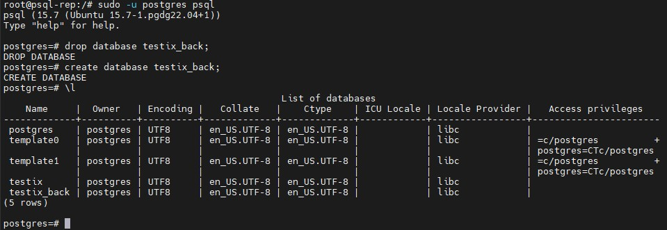

Далее восстанавливаем только структуру БД (без данных) с помощью ключа **--schema-only** следующей командой:  
```
sudo -u postgres pg_restore --schema-only -d testix_back /POSTGRES/pg_backup/testix_dump.gz
```
В таком случае сами таблицы создаются, но не заполняются:  

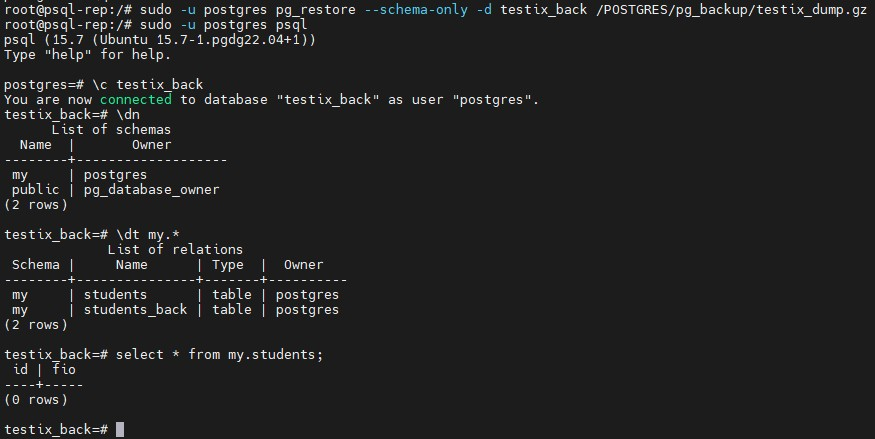

Далее восстанавливаем только таблицу **students_back** с ключем **--data-only**, который восстанавливает только данные без создания объектов командой:
```
sudo -u postgres pg_restore --data-only -d testix_back -t students_back /POSTGRES/pg_backup/testix_dump.gz
```
В таком случае одна таблица осталась пустой, а вторая таблица была заполнена данными:  

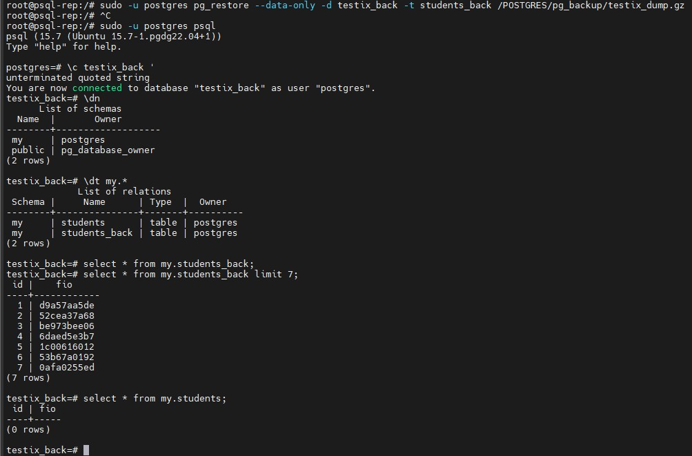

Думаю, такой вариант тоже подойдет, когда надо восстановить только одну таблицу.